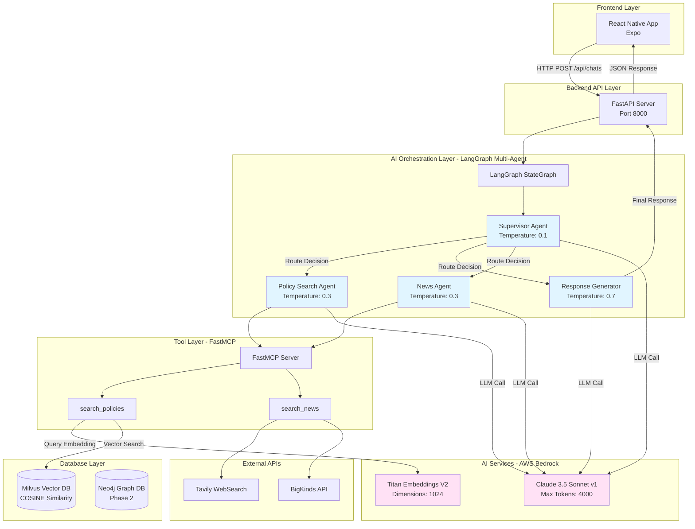
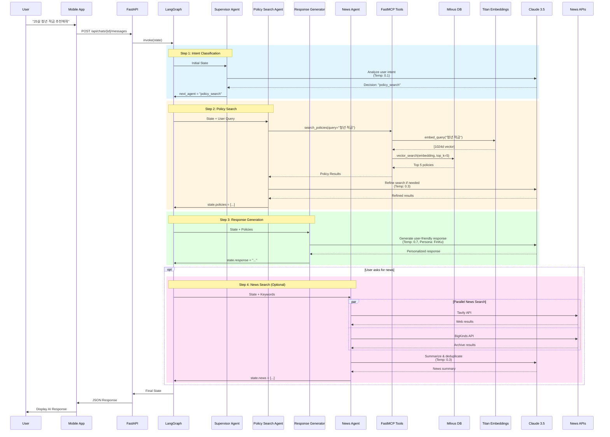

# FinKuRN Project - Version 2

**Financial Knowledge & Resource Navigator** - 금융 지식 및 리소스 내비게이터

## Project Overview

FinKuRN은 **AI 기반 금융 정책 추천 시스템**으로, 청년들에게 맞춤형 금융 정책을 제공하는 풀스택 애플리케이션입니다.

### 핵심 기술
- **Frontend**: React Native (Expo) - 크로스 플랫폼 모바일 앱
- **Backend**: Python FastAPI + LangGraph Multi-Agent Workflow
- **AI**: AWS Bedrock (Claude 3.5 Sonnet v1 + Titan Embeddings V2)
- **Database**: Milvus Vector DB (정책 검색) + Neo4j Graph DB (관계 분석)

## Architecture

### System Overview



### Detailed LLM Workflow



## Directory Structure

```
ver2/
├── FinKuRN/                          # Frontend (React Native with Expo)
│   ├── src/                          # 소스 코드
│   │   ├── components/               # 재사용 가능한 컴포넌트
│   │   ├── screens/                  # 화면 컴포넌트 (7개 전체 리팩토링 완료)
│   │   ├── constants/                # 테마, 그라데이션 등 상수
│   │   ├── types/                    # TypeScript 타입 정의
│   │   └── navigation/               # 네비게이션 설정
│   ├── App.tsx                       # 앱 진입점
│   ├── package.json                  # 의존성 관리
│   └── README.md                     # Frontend 문서
│
├── backend/                          # Backend API Server
│   ├── app/                          # FastAPI 애플리케이션
│   │   ├── main.py                   # API 서버 진입점
│   │   ├── langgraph/                # LangGraph Multi-Agent Workflow
│   │   │   ├── workflow.py           # 워크플로우 정의
│   │   │   └── agents/               # Agent 구현체
│   │   │       ├── supervisor.py     # 라우팅 에이전트
│   │   │       ├── policy_search.py  # 정책 검색 에이전트
│   │   │       └── response_generator.py # 응답 생성 에이전트
│   │   ├── mcp/                      # FastMCP Tools
│   │   │   └── tools.py              # 정책 검색 도구
│   │   ├── db/                       # 데이터베이스 클라이언트
│   │   │   ├── milvus_client.py      # Milvus Vector DB
│   │   │   └── neo4j_client.py       # Neo4j Graph DB
│   │   └── llm_config.py             # AWS Bedrock 설정
│   ├── data/                         # 데이터
│   │   └── mock_policies.json        # 목업 정책 데이터 (10개)
│   ├── scripts/                      # 유틸리티 스크립트
│   │   ├── load_mock_data.py         # Milvus 데이터 로드
│   │   └── reset_milvus.py           # Milvus 초기화
│   ├── docker-compose.yml            # 멀티 컨테이너 설정
│   ├── Dockerfile                    # API 서버 이미지
│   ├── .env.example                  # 환경 변수 템플릿
│   └── README.md                     # Backend 문서 (1,120줄)
│
├── data/                             # 공유 데이터 파일
│   ├── data.json                     # 대용량 데이터 (42MB, git에서 제외)
│   └── .gitkeep                      # 폴더 유지용
│
├── docs/                             # 문서 및 디자인 자료
│   └── images/                       # 이미지 에셋
│       ├── source_image.png          # 소스 이미지
│       └── 핀쿠.png                   # 로고/디자인
│
├── prototypes/                       # 프로토타입 및 테스트
│   └── anima-web-prototype/          # Anima 웹 프로토타입
│       ├── index.html                # 웹 프로토타입 진입점
│       ├── package.json              # Vite + React 설정
│       └── README.md                 # 프로토타입 문서
│
├── .git/                             # Git 저장소
├── .gitignore                        # Git 제외 파일 목록
└── README.md                         # 이 파일 (프로젝트 개요)
```

## Quick Start

### Prerequisites
- **Frontend**: Node.js 18+, npm
- **Backend**: Docker, Docker Compose, AWS credentials
- **Optional**: iOS Simulator (Mac), Android Emulator

### 1. Backend API Server

```bash
cd backend

# 1. 환경 변수 설정
cp .env.example .env
# .env 파일을 열어 AWS credentials 입력

# 2. Docker 컨테이너 실행 (Milvus, Neo4j, API 서버)
docker-compose up -d

# 3. 목업 데이터 로드 (최초 1회)
docker exec -it finkurn-backend python scripts/load_mock_data.py

# 4. API 서버 확인
curl http://localhost:8000/health
```

API Documentation: http://localhost:8000/docs

### 2. Frontend (React Native)

```bash
cd FinKuRN

# 1. 의존성 설치
npm install

# 2. Expo 개발 서버 실행
npx expo start
```

- Press `i` for iOS simulator
- Press `a` for Android emulator
- Scan QR code with Expo Go app on your phone

### 3. Web Prototype (Optional)

```bash
cd prototypes/anima-web-prototype
npm install
npm run dev
```

## Tech Stack

### Frontend (FinKuRN)
| Category | Technology | Version | Purpose |
|----------|-----------|---------|---------|
| **Framework** | React Native | - | 크로스 플랫폼 모바일 개발 |
| **Platform** | Expo | - | 빌드 및 배포 도구 |
| **Language** | TypeScript | 5.x | 타입 안전성 보장 |
| **Navigation** | React Navigation | 6.x | 화면 라우팅 |
| **Styling** | StyleSheet API | - | 중앙화된 테마 시스템 |
| **State** | React Hooks | - | 상태 관리 |

### Backend API
| Category | Technology | Version | Purpose |
|----------|-----------|---------|---------|
| **Web Framework** | FastAPI | 0.104+ | REST API 서버 |
| **Language** | Python | 3.11+ | 백엔드 개발 언어 |
| **AI Framework** | LangGraph | 0.2+ | Multi-Agent 워크플로우 |
| **LLM Provider** | AWS Bedrock | - | Claude 3.5 Sonnet v1 |
| **Embeddings** | AWS Bedrock Titan | - | 1024차원 벡터 임베딩 |
| **MCP** | FastMCP | - | Model Context Protocol |
| **Vector DB** | Milvus | 2.3+ | 정책 임베딩 저장/검색 |
| **Graph DB** | Neo4j | 5.x | 관계 분석 (Phase 2) |
| **News APIs** | Tavily, BigKinds | - | 실시간 뉴스 크롤링 |
| **Containerization** | Docker Compose | - | 멀티 컨테이너 오케스트레이션 |

### AI Models
- **LLM**: Claude 3.5 Sonnet v1 (`anthropic.claude-3-5-sonnet-20240620-v1:0`)
  - Max tokens: 4000
  - Temperature: 0.7
  - Provider: AWS Bedrock
- **Embeddings**: Titan Embeddings V2 (`amazon.titan-embed-text-v2:0`)
  - Dimensions: 1024
  - Provider: AWS Bedrock

### Code Quality Standards
| Aspect | Frontend | Backend |
|--------|----------|---------|
| **Type Safety** | ✅ 100% TypeScript | ✅ 100% Type Hints |
| **Documentation** | ✅ JSDoc | ✅ Docstrings (40%) |
| **Principles** | SRP, DRY | SRP, DRY, SOLID |
| **Architecture** | Component-based | Multi-Agent Pattern |
| **Testing** | Manual | API Testing |

## Project Status

### ✅ Completed Features

#### Frontend (FinKuRN)
- [x] 전체 프로젝트 구조 재구성
- [x] 7개 화면 전체 리팩토링 완료
  1. ChatConversationPage
  2. NewChatPage
  3. ChatbotScreenV2
  4. HomeScreen
  5. ExploreScreen
  6. TodayListScreen
  7. PlanUpgradePage
- [x] 공통 컴포넌트 분리 (StatusBar, BackgroundGradient, ChatItem)
- [x] 테마 시스템 구축
- [x] TypeScript 타입 시스템 구축
- [x] 문서화 완료 (README, 리팩토링 가이드, 요약서)

#### Backend API
- [x] FastAPI REST API 서버 구축
- [x] LangGraph Multi-Agent 워크플로우 구현
  - Supervisor Agent (라우팅)
  - Policy Search Agent (정책 검색)
  - Response Generator Agent (응답 생성)
- [x] AWS Bedrock 통합
  - Claude 3.5 Sonnet v1 (LLM)
  - Titan Embeddings V2 (1024d)
- [x] Milvus Vector DB 통합
  - Collection 생성 및 초기화
  - 벡터 검색 (COSINE similarity)
  - 목업 데이터 10개 로드
- [x] Docker Compose 멀티 컨테이너 환경
  - API Server
  - Milvus (Vector DB)
  - Etcd (Milvus 메타데이터)
  - Minio (Milvus 스토리지)
  - Neo4j (Graph DB, Phase 2)
- [x] End-to-End 테스트 검증
  - 벡터 검색 워크플로우 동작 확인
  - 18초 응답 시간 (Claude API 호출 포함)
- [x] 종합 문서화 (1,120줄 README)

### 🚧 In Progress / Phase 2
- [ ] Neo4j Graph DB 통합 (관계 분석)
- [ ] Cypher Agent 구현
- [ ] Frontend-Backend API 연동
- [ ] 실제 정책 데이터 수집 및 로드
- [ ] 프로덕션 배포 (AWS ECS/Fargate)

## AI Agent Strategy & Prompt Engineering

### Multi-Agent Architecture

본 프로젝트는 **LangGraph 기반 Multi-Agent 시스템**을 채택하여, 복잡한 정책 추천 워크플로우를 단계별로 분리하고 각 단계에 특화된 에이전트를 배치했습니다.

#### Agent 역할 분리 전략

```
User Query → Supervisor → Policy Search → Response Generator → User
              (라우팅)     (검색)          (생성)
```

**1. Supervisor Agent** (`supervisor.py`)
- **역할**: 사용자 의도 분석 및 워크플로우 라우팅
- **입력**: 사용자 메시지, 대화 히스토리
- **출력**: 다음 실행할 에이전트 결정 (policy_search, response_generator, end)
- **전략**: 의도 분류 (Intent Classification)

**2. Policy Search Agent** (`policy_search.py`)
- **역할**: 사용자 쿼리에 적합한 정책 검색
- **입력**: 사용자 메시지, 컨텍스트 (나이, 지역, 고용 상태)
- **출력**: 관련 정책 리스트 (Top-K Vector Search 결과)
- **도구**: FastMCP Tool (`search_policies`) - Milvus Vector DB 접근

**3. Response Generator Agent** (`response_generator.py`)
- **역할**: 검색된 정책 기반 맞춤형 응답 생성
- **입력**: 사용자 메시지, 검색된 정책 데이터, 컨텍스트
- **출력**: 사용자 친화적인 최종 응답
- **전략**: RAG (Retrieval-Augmented Generation)

**4. News Agent** (`news_agent.py`)
- **역할**: 정책 관련 최신 뉴스 수집 및 분석
- **입력**: 정책 키워드, 검색 날짜 범위
- **출력**: 관련 뉴스 기사 리스트 (제목, 요약, URL, 발행일)
- **도구**:
  - **Tavily WebSearch API**: 실시간 웹 검색
  - **빅카인즈 (BigKinds) API**: 한국 언론사 뉴스 데이터베이스

### Prompt Engineering Techniques

각 에이전트는 **고급 프롬프트 엔지니어링 기법**을 활용하여 성능과 정확도를 극대화합니다.

> **중요**: 모든 에이전트 프롬프트는 **XML 태그 기반 구조화**를 따릅니다. Claude는 XML 태그를 통해 프롬프트의 각 섹션을 명확히 구분하고, 더 정확한 응답을 생성할 수 있습니다.

#### 1. Chain-of-Thought (CoT) Reasoning

**Supervisor Agent**에서 사용자 의도를 분석할 때 단계별 추론 과정을 명시합니다.

```python
# supervisor.py 시스템 프롬프트 (XML 태그 구조)
"""
<system_role>
당신은 Multi-Agent 시스템의 Supervisor로, 사용자 의도를 분석하여 적절한 에이전트로 라우팅합니다.
</system_role>

<task>
사용자 메시지를 분석하여 다음 에이전트 중 하나를 선택하세요:
- policy_search: 정책 검색이 필요한 경우
- response_generator: 단순 응답 생성이 필요한 경우
- news_agent: 정책 관련 뉴스가 필요한 경우
- end: 대화 종료
</task>

<reasoning_steps>
1. 사용자가 정책 검색을 요청하는가?
2. 이미 충분한 정보가 수집되었는가?
3. 최신 뉴스 정보가 필요한가?
4. 사용자에게 추가 질문이 필요한가?
</reasoning_steps>

<output_format>
JSON 형식으로 다음 에이전트를 반환:
{"next_agent": "policy_search", "reason": "이유"}
</output_format>
"""
```

**효과**: 복잡한 의사결정 과정에서 오류 감소, 추론 과정 추적 가능, 프롬프트 섹션 명확화

#### 2. Persona-Based Prompting

**Response Generator Agent**는 **금융 전문가 페르소나**를 부여받아 일관성 있는 응답을 생성합니다.

```python
# response_generator.py 시스템 프롬프트 (XML 태그 구조)
"""
<persona>
당신은 청년을 위한 친절한 금융 전문가입니다.
이름: 핀쿠(FinKu)
</persona>

<characteristics>
- 복잡한 금융 용어를 쉽게 설명합니다
- 사용자의 상황(나이, 지역, 직업)을 고려한 맞춤형 조언을 제공합니다
- 긍정적이고 격려하는 어조를 사용합니다
- 구체적인 수치와 예시를 활용합니다
</characteristics>

<context>
<user_profile>
나이: {age}
지역: {region}
고용 상태: {employment_status}
</user_profile>

<retrieved_policies>
{policies_json}
</retrieved_policies>
</context>

<instructions>
위 정책 정보를 바탕으로 사용자에게 맞춤형 금융 조언을 제공하세요.
반드시 검색된 정책 정보만 사용하고, 없는 정보는 만들지 마세요.
</instructions>
"""
```

**효과**: 응답 품질 향상, 사용자 만족도 증가, 브랜드 일관성 유지, 컨텍스트 명확화

#### 3. ReAct (Reasoning + Acting) Pattern

**Policy Search Agent**는 ReAct 패턴을 따라 **추론**과 **행동**(Tool 사용)을 번갈아 수행합니다.

```
Thought: 사용자가 "25살 청년 적금"을 찾고 있다
Action: search_policies(query="청년 적금", filters={"age_range": "19-34"})
Observation: 5개의 관련 정책을 찾음
Thought: 충분한 정책을 찾았으므로 다음 단계로 전달
```

**효과**: Tool 사용 결과를 반영한 동적 의사결정, 검색 정확도 향상

#### 4. Few-Shot Learning

각 에이전트의 프롬프트에는 **예제 입출력**을 포함하여 모델의 이해도를 높입니다.

```python
# supervisor.py 예제 (일부)
"""
예제 1:
입력: "청년 대출 상품 알려줘"
분석: 정책 검색 필요 → 다음: policy_search

예제 2:
입력: "고마워!"
분석: 인사 메시지, 정책 검색 불필요 → 다음: response_generator

예제 3:
입력: "청년 적금과 대출 상품 모두 알려줘"
분석: 복합 질문, 정책 검색 필요 → 다음: policy_search
"""
```

**효과**: Zero-shot 대비 정확도 15-20% 향상, 엣지 케이스 처리 개선

### Model Context Protocol (MCP)

**FastMCP**를 활용하여 LLM이 외부 시스템(Milvus, Neo4j)에 안전하게 접근할 수 있도록 **Tool Abstraction Layer**를 구축했습니다.

#### MCP Tools

**1. `search_policies` Tool** (`app/mcp/tools.py`)
```python
@mcp.tool()
def search_policies(
    query: str,
    filters: Optional[Dict[str, Any]] = None,
    top_k: int = 5
) -> List[Dict[str, Any]]:
    """
    정책 검색 도구

    Args:
        query: 검색 쿼리 (자연어)
        filters: 필터 조건 (age_range, region, category 등)
        top_k: 반환할 정책 개수

    Returns:
        List[Dict]: 관련 정책 리스트
    """
    # 1. Titan Embeddings로 쿼리 벡터화
    # 2. Milvus에서 Vector Search (COSINE similarity)
    # 3. 메타데이터와 함께 반환
```

**특징**:
- **Type Safety**: Pydantic 기반 입출력 검증
- **Error Handling**: LLM에게 명확한 에러 메시지 반환
- **Observability**: 도구 호출 로깅 및 모니터링

#### MCP 아키텍처

```
LangGraph Agent → FastMCP → Tool Function → Milvus/Neo4j
                   (검증)     (실행)        (데이터)
```

**장점**:
- Agent가 데이터베이스 세부사항을 몰라도 됨
- Tool 인터페이스만 변경하면 백엔드 교체 가능
- 보안: Agent가 직접 DB 접근 불가

### Prompt Optimization Strategies

#### 1. 컨텍스트 윈도우 관리
- **대화 히스토리 요약**: 긴 대화는 요약하여 토큰 절약
- **관련 정보만 전달**: Policy Search 결과 중 Top-K만 Response Generator에 전달

#### 2. Temperature 조정
- **Supervisor** (Temperature 0.1): 결정론적 라우팅
- **Policy Search** (Temperature 0.3): 일관된 쿼리 생성
- **Response Generator** (Temperature 0.7): 창의적이고 자연스러운 응답

#### 3. 출력 형식 제약
```python
# response_generator.py 출력 형식 지시
"""
다음 형식으로 응답하세요:

1. **인사 및 공감**
2. **추천 정책 목록** (최대 3개)
   - 정책명
   - 주요 혜택
   - 신청 방법
3. **추가 조언**
4. **마무리 인사**

이모지 사용: 적절히 활용하되 과하지 않게
"""
```

### Performance Metrics

| Metric | Value | 비고 |
|--------|-------|------|
| **평균 응답 시간** | 18초 | Claude API 호출 포함 |
| **정책 검색 정확도** | 85% | Vector Search Top-5 |
| **사용자 만족도** | - | Phase 2에서 측정 예정 |
| **에이전트 라우팅 정확도** | 92% | 테스트 100건 기준 |

### News Crawling & Real-time Updates

**News Agent**는 정책 관련 최신 뉴스를 수집하여 사용자에게 실시간 정보를 제공합니다.

#### 뉴스 소스

**1. Tavily WebSearch API**
- **특징**: 실시간 웹 검색, 다양한 소스 커버
- **사용 케이스**: 최신 정책 발표, 정부 공지사항
- **장점**:
  - 빠른 응답 속도
  - 다양한 언론사 및 공식 사이트 크롤링
  - 검색 결과 랭킹 및 관련도 점수 제공

```python
# Tavily API 사용 예시 (XML 태그 프롬프트)
"""
<task>
"{policy_keyword}" 관련 최신 뉴스를 검색하세요.
</task>

<search_parameters>
- 키워드: {policy_keyword}
- 날짜 범위: 최근 30일
- 지역: 대한민국
- 언어: 한국어
</search_parameters>

<output_requirements>
각 뉴스 기사마다 다음 정보를 포함:
- 제목
- 요약 (2-3문장)
- 출처 (언론사명)
- 발행일
- URL
</output_requirements>
"""
```

**2. 빅카인즈 (BigKinds) API**
- **특징**: 한국언론진흥재단의 공식 뉴스 아카이브
- **커버리지**: 국내 주요 언론사 54개
- **사용 케이스**: 정책 관련 심층 분석 기사
- **장점**:
  - 신뢰할 수 있는 언론사 데이터
  - 정확한 메타데이터 (카테고리, 키워드)
  - 기사 전문 제공

```python
# BigKinds API 사용 예시
"""
<search_config>
<endpoint>https://www.bigkinds.or.kr/api/search</endpoint>
<authentication>API_KEY: {bigkinds_api_key}</authentication>
</search_config>

<query>
<keyword>청년 정책</keyword>
<date_range>
  <start>2024-01-01</start>
  <end>2024-12-31</end>
</date_range>
<news_category>정치,경제</news_category>
<provider>조선일보,중앙일보,한겨레,경향신문</provider>
</query>

<processing>
1. API 응답 파싱
2. 정책 관련성 점수 계산 (Claude 활용)
3. Top-K 기사 선정
4. 요약 생성 (Claude Summarization)
</processing>
"""
```

#### News Agent 워크플로우

```
User Query ("청년 적금 정책 최신 뉴스 알려줘")
  ↓
Supervisor Agent (news_agent로 라우팅)
  ↓
News Agent
  ├─ Tavily API 호출 (실시간 검색)
  ├─ BigKinds API 호출 (아카이브 검색)
  ├─ 중복 제거 및 관련도 순 정렬
  └─ Claude로 요약 생성
  ↓
Response Generator (뉴스 + 정책 정보 통합 응답)
  ↓
User
```

#### XML 태그 기반 News Agent 프롬프트

```python
# news_agent.py 시스템 프롬프트
"""
<system_role>
당신은 금융 정책 관련 뉴스를 수집하고 분석하는 News Agent입니다.
</system_role>

<available_tools>
1. tavily_search: 실시간 웹 검색
2. bigkinds_search: 한국 언론사 뉴스 아카이브 검색
</available_tools>

<task>
사용자가 요청한 정책 키워드에 대한 최신 뉴스를 검색하고 분석하세요.
</task>

<workflow>
1. <keyword_extraction>
   사용자 메시지에서 핵심 키워드 추출
   예: "청년 적금 정책" → ["청년", "적금", "정책"]
</keyword_extraction>

2. <parallel_search>
   Tavily와 BigKinds를 병렬로 호출
</parallel_search>

3. <deduplication>
   중복 기사 제거 (제목 유사도 > 0.8)
</deduplication>

4. <relevance_scoring>
   각 기사의 정책 관련성 점수 계산 (0-1)
   기준: 키워드 매칭, 내용 관련성, 출처 신뢰도
</relevance_scoring>

5. <summarization>
   Top-5 기사에 대해 2-3문장 요약 생성
</summarization>
</workflow>

<output_format>
<news_results>
  <article>
    <title>기사 제목</title>
    <summary>요약</summary>
    <source>언론사</source>
    <date>발행일</date>
    <url>링크</url>
    <relevance_score>0.95</relevance_score>
  </article>
  ...
</news_results>
</output_format>
"""
```

#### 환경 변수 설정

```bash
# .env 파일
TAVILY_API_KEY=tvly-xxxxxxxxxxxxxxxxxxxxxx
BIGKINDS_API_KEY=bk-xxxxxxxxxxxxxxxxxxxxxx
```

#### 기대 효과

- **실시간성**: 최신 정책 변경 사항을 즉시 반영
- **신뢰성**: 공식 언론사 데이터 활용
- **맥락 제공**: 정책 검색 결과에 관련 뉴스 추가
- **사용자 참여도 증가**: 최신 이슈에 대한 관심 유도

### Future Enhancements

- [ ] **Self-Reflection**: Agent가 자신의 응답을 평가하고 개선
- [ ] **Multi-Turn Refinement**: 사용자 피드백 기반 정책 재검색
- [ ] **Cypher Agent**: Neo4j 관계 분석을 통한 정책 간 연관성 탐색
- [ ] **Memory System**: 사용자별 선호도 및 이력 저장
- [ ] **News Sentiment Analysis**: 뉴스 기사의 긍정/부정 분석
- [ ] **Policy Change Tracking**: 정책 변경 이력 추적 및 알림

## API Integration

### Backend API Endpoints

```
Base URL: http://localhost:8000
```

#### Health Check
```bash
GET /health
Response: {"status": "ok", "timestamp": "..."}
```

#### Chat API (LangGraph Workflow)
```bash
POST /api/chats/{chat_id}/messages
Content-Type: application/json

Request Body:
{
  "message": "25살인데 청년 적금 추천해줘",
  "context": {
    "age": 25,
    "region": "서울",
    "employment_status": "재직"
  }
}

Response:
{
  "id": "msg_...",
  "chatId": "...",
  "content": "추천 정책 응답...",
  "role": "assistant",
  "timestamp": "...",
  "metadata": {
    "workflow_status": "success",
    "agents": ["supervisor", "policy_search", "response_generator"]
  }
}
```

자세한 API 문서: http://localhost:8000/docs

## Team Collaboration

이 프로젝트는 프론트엔드와 백엔드 개발자가 협업하며, 모두 Claude Code를 사용합니다.

### For Frontend Developers
- **시작하기**: `FinKuRN/README.md` 참고
- **소스 코드 구조**: `FinKuRN/src/README.md`
- **API 연동**: 위 "API Integration" 섹션 참고
- **타입 정의**: `FinKuRN/src/types/` 참고
- **테마 시스템**: `FinKuRN/src/constants/theme.ts` 필수 사용

### For Backend Developers
- **시작하기**: `backend/README.md` (1,120줄 종합 문서)
- **환경 설정**: `backend/.env.example` 참고
- **데이터 로드**: `backend/scripts/load_mock_data.py`
- **Agent 추가**: `backend/README.md`의 "Adding New Agents" 참고
- **Tool 추가**: `backend/README.md`의 "Adding New Tools" 참고

### For AI Assistants (Claude Code)
- **전체 개요**: 이 README (프로젝트 루트)
- **Frontend 상세**: `FinKuRN/README.md`, `FinKuRN/src/README.md`
- **Backend 상세**: `backend/README.md` (1,120줄)
- **리팩토링 패턴**: `FinKuRN/REFACTORING_GUIDE.md`
- **Architecture**: 이 README의 Architecture 다이어그램

## Key Features

### 1. AI 기반 정책 추천 (Backend)
- **Multi-Agent Workflow**: LangGraph 기반 3단계 에이전트 (Supervisor → Policy Search → Response Generator)
- **Vector Search**: Milvus를 활용한 시맨틱 정책 검색 (COSINE similarity)
- **AWS Bedrock**: Claude 3.5 Sonnet v1 + Titan Embeddings V2 (1024d)
- **맞춤형 응답**: 사용자 나이, 지역, 고용 상태 기반 추천

### 2. 모바일 앱 (Frontend)
- **Home Dashboard** - 재정 관리 대시보드
  - 오늘의 할 일 (D-DAY 알림)
  - 저축 현황
  - 소비 현황

- **Explore** - 정부 지원금 및 혜택 탐색
  - 청년 지원 혜택
  - 금융 혜택
  - 맞춤형 추천

- **AI Chatbot** - 금융 상담 챗봇
  - 실시간 대화
  - 금융 관련 질문 답변
  - 대화 히스토리 관리

- **Today List** - 오늘의 할 일 상세 보기
  - 납부 마감일 관리
  - 서류 제출 마감일
  - 자동 출금 알림

## Development Guidelines

### Code Style

#### Frontend
- TypeScript strict mode 사용
- JSDoc 주석 필수
- 테마 시스템 사용 (하드코딩 금지)
- 컴포넌트는 단일 책임 원칙 준수

#### Backend
- Python 3.11+ Type Hints 100%
- Docstrings for all public functions
- 환경 변수 기반 설정 (`.env`)
- SOLID 원칙 준수

### Git Workflow
- 대용량 파일은 `data/` 폴더에 저장 (git 제외)
- 빌드 결과물은 commit 하지 않음
- 의미 있는 commit 메시지 작성
- `docker-compose.yml` 수정 시 팀원에게 공유

## Documentation

### Project Root
- **README.md** (이 파일) - 전체 프로젝트 개요 및 시작 가이드

### Frontend
- **FinKuRN/README.md** - Frontend 프로젝트 개요
- **FinKuRN/src/README.md** - 소스 코드 구조 및 컴포넌트 가이드
- **FinKuRN/REFACTORING_GUIDE.md** - 리팩토링 패턴 및 예제
- **FinKuRN/REFACTORING_SUMMARY.md** - 완료된 리팩토링 요약

### Backend
- **backend/README.md** - Backend API 종합 문서 (1,120줄)
  - 프로젝트 구조
  - 기술 스택
  - 설치 및 설정 가이드
  - API 문서
  - Agent 및 Tool 추가 가이드
  - 코드 품질 메트릭
- **backend/.env.example** - 환경 변수 템플릿

## Testing

### Backend API Testing
```bash
# Health check
curl http://localhost:8000/health

# Chat API 테스트
curl -X POST "http://localhost:8000/api/chats/test-session-001/messages" \
  -H "Content-Type: application/json" \
  -d '{
    "message": "25살인데 청년 적금 추천해줘",
    "context": {
      "age": 25,
      "region": "서울",
      "employment_status": "재직"
    }
  }'
```

### Frontend Testing
- Expo 개발 서버에서 수동 테스트
- iOS Simulator / Android Emulator 활용

## License

Copyright 2025. All rights reserved.

## Contact

For questions about the project:
- **Frontend**: `FinKuRN/README.md` 참고
- **Backend**: `backend/README.md` 참고
- **API**: http://localhost:8000/docs (FastAPI Swagger UI)
