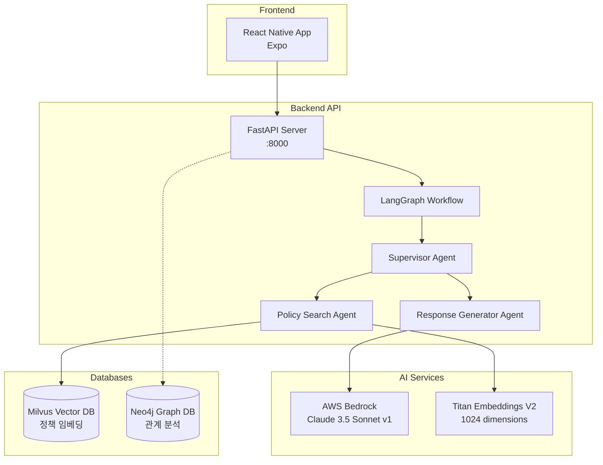

# FinKuRN Project - Version 2

**Financial Knowledge & Resource Navigator** - 금융 지식 및 리소스 내비게이터

## Project Overview

FinKuRN은 **AI 기반 금융 정책 추천 시스템**으로, 청년들에게 맞춤형 금융 정책을 제공하는 풀스택 애플리케이션입니다.

### 핵심 기술
- **Frontend**: React Native (Expo) - 크로스 플랫폼 모바일 앱
- **Backend**: Python FastAPI + LangGraph Multi-Agent Workflow
- **AI**: AWS Bedrock (Claude 3.5 Sonnet v1 + Titan Embeddings V2)
- **Database**: Milvus Vector DB (정책 검색) + Neo4j Graph DB (관계 분석)

## Architecture



## Directory Structure

```
ver2/
├── FinKuRN/                          # Frontend (React Native with Expo)
│   ├── src/                          # 소스 코드
│   │   ├── components/               # 재사용 가능한 컴포넌트
│   │   ├── screens/                  # 화면 컴포넌트 (7개 전체 리팩토링 완료)
│   │   ├── constants/                # 테마, 그라데이션 등 상수
│   │   ├── types/                    # TypeScript 타입 정의
│   │   └── navigation/               # 네비게이션 설정
│   ├── App.tsx                       # 앱 진입점
│   ├── package.json                  # 의존성 관리
│   └── README.md                     # Frontend 문서
│
├── backend/                          # Backend API Server
│   ├── app/                          # FastAPI 애플리케이션
│   │   ├── main.py                   # API 서버 진입점
│   │   ├── langgraph/                # LangGraph Multi-Agent Workflow
│   │   │   ├── workflow.py           # 워크플로우 정의
│   │   │   └── agents/               # Agent 구현체
│   │   │       ├── supervisor.py     # 라우팅 에이전트
│   │   │       ├── policy_search.py  # 정책 검색 에이전트
│   │   │       └── response_generator.py # 응답 생성 에이전트
│   │   ├── mcp/                      # FastMCP Tools
│   │   │   └── tools.py              # 정책 검색 도구
│   │   ├── db/                       # 데이터베이스 클라이언트
│   │   │   ├── milvus_client.py      # Milvus Vector DB
│   │   │   └── neo4j_client.py       # Neo4j Graph DB
│   │   └── llm_config.py             # AWS Bedrock 설정
│   ├── data/                         # 데이터
│   │   └── mock_policies.json        # 목업 정책 데이터 (10개)
│   ├── scripts/                      # 유틸리티 스크립트
│   │   ├── load_mock_data.py         # Milvus 데이터 로드
│   │   └── reset_milvus.py           # Milvus 초기화
│   ├── docker-compose.yml            # 멀티 컨테이너 설정
│   ├── Dockerfile                    # API 서버 이미지
│   ├── .env.example                  # 환경 변수 템플릿
│   └── README.md                     # Backend 문서 (1,120줄)
│
├── data/                             # 공유 데이터 파일
│   ├── data.json                     # 대용량 데이터 (42MB, git에서 제외)
│   └── .gitkeep                      # 폴더 유지용
│
├── docs/                             # 문서 및 디자인 자료
│   └── images/                       # 이미지 에셋
│       ├── source_image.png          # 소스 이미지
│       └── 핀쿠.png                   # 로고/디자인
│
├── prototypes/                       # 프로토타입 및 테스트
│   └── anima-web-prototype/          # Anima 웹 프로토타입
│       ├── index.html                # 웹 프로토타입 진입점
│       ├── package.json              # Vite + React 설정
│       └── README.md                 # 프로토타입 문서
│
├── .git/                             # Git 저장소
├── .gitignore                        # Git 제외 파일 목록
└── README.md                         # 이 파일 (프로젝트 개요)
```

## Quick Start

### Prerequisites
- **Frontend**: Node.js 18+, npm
- **Backend**: Docker, Docker Compose, AWS credentials
- **Optional**: iOS Simulator (Mac), Android Emulator

### 1. Backend API Server

```bash
cd backend

# 1. 환경 변수 설정
cp .env.example .env
# .env 파일을 열어 AWS credentials 입력

# 2. Docker 컨테이너 실행 (Milvus, Neo4j, API 서버)
docker-compose up -d

# 3. 목업 데이터 로드 (최초 1회)
docker exec -it finkurn-backend python scripts/load_mock_data.py

# 4. API 서버 확인
curl http://localhost:8000/health
```

API Documentation: http://localhost:8000/docs

### 2. Frontend (React Native)

```bash
cd FinKuRN

# 1. 의존성 설치
npm install

# 2. Expo 개발 서버 실행
npx expo start
```

- Press `i` for iOS simulator
- Press `a` for Android emulator
- Scan QR code with Expo Go app on your phone

### 3. Web Prototype (Optional)

```bash
cd prototypes/anima-web-prototype
npm install
npm run dev
```

## Tech Stack

### Frontend (FinKuRN)
| Category | Technology | Version | Purpose |
|----------|-----------|---------|---------|
| **Framework** | React Native | - | 크로스 플랫폼 모바일 개발 |
| **Platform** | Expo | - | 빌드 및 배포 도구 |
| **Language** | TypeScript | 5.x | 타입 안전성 보장 |
| **Navigation** | React Navigation | 6.x | 화면 라우팅 |
| **Styling** | StyleSheet API | - | 중앙화된 테마 시스템 |
| **State** | React Hooks | - | 상태 관리 |

### Backend API
| Category | Technology | Version | Purpose |
|----------|-----------|---------|---------|
| **Web Framework** | FastAPI | 0.104+ | REST API 서버 |
| **Language** | Python | 3.11+ | 백엔드 개발 언어 |
| **AI Framework** | LangGraph | 0.2+ | Multi-Agent 워크플로우 |
| **LLM Provider** | AWS Bedrock | - | Claude 3.5 Sonnet v1 |
| **Embeddings** | AWS Bedrock Titan | - | 1024차원 벡터 임베딩 |
| **MCP** | FastMCP | - | Model Context Protocol |
| **Vector DB** | Milvus | 2.3+ | 정책 임베딩 저장/검색 |
| **Graph DB** | Neo4j | 5.x | 관계 분석 (Phase 2) |
| **Containerization** | Docker Compose | - | 멀티 컨테이너 오케스트레이션 |

### AI Models
- **LLM**: Claude 3.5 Sonnet v1 (`anthropic.claude-3-5-sonnet-20240620-v1:0`)
  - Max tokens: 4000
  - Temperature: 0.7
  - Provider: AWS Bedrock
- **Embeddings**: Titan Embeddings V2 (`amazon.titan-embed-text-v2:0`)
  - Dimensions: 1024
  - Provider: AWS Bedrock

### Code Quality Standards
| Aspect | Frontend | Backend |
|--------|----------|---------|
| **Type Safety** | ✅ 100% TypeScript | ✅ 100% Type Hints |
| **Documentation** | ✅ JSDoc | ✅ Docstrings (40%) |
| **Principles** | SRP, DRY | SRP, DRY, SOLID |
| **Architecture** | Component-based | Multi-Agent Pattern |
| **Testing** | Manual | API Testing |

## Project Status

### ✅ Completed Features

#### Frontend (FinKuRN)
- [x] 전체 프로젝트 구조 재구성
- [x] 7개 화면 전체 리팩토링 완료
  1. ChatConversationPage
  2. NewChatPage
  3. ChatbotScreenV2
  4. HomeScreen
  5. ExploreScreen
  6. TodayListScreen
  7. PlanUpgradePage
- [x] 공통 컴포넌트 분리 (StatusBar, BackgroundGradient, ChatItem)
- [x] 테마 시스템 구축
- [x] TypeScript 타입 시스템 구축
- [x] 문서화 완료 (README, 리팩토링 가이드, 요약서)

#### Backend API
- [x] FastAPI REST API 서버 구축
- [x] LangGraph Multi-Agent 워크플로우 구현
  - Supervisor Agent (라우팅)
  - Policy Search Agent (정책 검색)
  - Response Generator Agent (응답 생성)
- [x] AWS Bedrock 통합
  - Claude 3.5 Sonnet v1 (LLM)
  - Titan Embeddings V2 (1024d)
- [x] Milvus Vector DB 통합
  - Collection 생성 및 초기화
  - 벡터 검색 (COSINE similarity)
  - 목업 데이터 10개 로드
- [x] Docker Compose 멀티 컨테이너 환경
  - API Server
  - Milvus (Vector DB)
  - Etcd (Milvus 메타데이터)
  - Minio (Milvus 스토리지)
  - Neo4j (Graph DB, Phase 2)
- [x] End-to-End 테스트 검증
  - 벡터 검색 워크플로우 동작 확인
  - 18초 응답 시간 (Claude API 호출 포함)
- [x] 종합 문서화 (1,120줄 README)

### 🚧 In Progress / Phase 2
- [ ] Neo4j Graph DB 통합 (관계 분석)
- [ ] Cypher Agent 구현
- [ ] Frontend-Backend API 연동
- [ ] 실제 정책 데이터 수집 및 로드
- [ ] 프로덕션 배포 (AWS ECS/Fargate)

## API Integration

### Backend API Endpoints

```
Base URL: http://localhost:8000
```

#### Health Check
```bash
GET /health
Response: {"status": "ok", "timestamp": "..."}
```

#### Chat API (LangGraph Workflow)
```bash
POST /api/chats/{chat_id}/messages
Content-Type: application/json

Request Body:
{
  "message": "25살인데 청년 적금 추천해줘",
  "context": {
    "age": 25,
    "region": "서울",
    "employment_status": "재직"
  }
}

Response:
{
  "id": "msg_...",
  "chatId": "...",
  "content": "추천 정책 응답...",
  "role": "assistant",
  "timestamp": "...",
  "metadata": {
    "workflow_status": "success",
    "agents": ["supervisor", "policy_search", "response_generator"]
  }
}
```

자세한 API 문서: http://localhost:8000/docs

## Team Collaboration

이 프로젝트는 프론트엔드와 백엔드 개발자가 협업하며, 모두 Claude Code를 사용합니다.

### For Frontend Developers
- **시작하기**: `FinKuRN/README.md` 참고
- **소스 코드 구조**: `FinKuRN/src/README.md`
- **API 연동**: 위 "API Integration" 섹션 참고
- **타입 정의**: `FinKuRN/src/types/` 참고
- **테마 시스템**: `FinKuRN/src/constants/theme.ts` 필수 사용

### For Backend Developers
- **시작하기**: `backend/README.md` (1,120줄 종합 문서)
- **환경 설정**: `backend/.env.example` 참고
- **데이터 로드**: `backend/scripts/load_mock_data.py`
- **Agent 추가**: `backend/README.md`의 "Adding New Agents" 참고
- **Tool 추가**: `backend/README.md`의 "Adding New Tools" 참고

### For AI Assistants (Claude Code)
- **전체 개요**: 이 README (프로젝트 루트)
- **Frontend 상세**: `FinKuRN/README.md`, `FinKuRN/src/README.md`
- **Backend 상세**: `backend/README.md` (1,120줄)
- **리팩토링 패턴**: `FinKuRN/REFACTORING_GUIDE.md`
- **Architecture**: 이 README의 Architecture 다이어그램

## Key Features

### 1. AI 기반 정책 추천 (Backend)
- **Multi-Agent Workflow**: LangGraph 기반 3단계 에이전트 (Supervisor → Policy Search → Response Generator)
- **Vector Search**: Milvus를 활용한 시맨틱 정책 검색 (COSINE similarity)
- **AWS Bedrock**: Claude 3.5 Sonnet v1 + Titan Embeddings V2 (1024d)
- **맞춤형 응답**: 사용자 나이, 지역, 고용 상태 기반 추천

### 2. 모바일 앱 (Frontend)
- **Home Dashboard** - 재정 관리 대시보드
  - 오늘의 할 일 (D-DAY 알림)
  - 저축 현황
  - 소비 현황

- **Explore** - 정부 지원금 및 혜택 탐색
  - 청년 지원 혜택
  - 금융 혜택
  - 맞춤형 추천

- **AI Chatbot** - 금융 상담 챗봇
  - 실시간 대화
  - 금융 관련 질문 답변
  - 대화 히스토리 관리

- **Today List** - 오늘의 할 일 상세 보기
  - 납부 마감일 관리
  - 서류 제출 마감일
  - 자동 출금 알림

## Development Guidelines

### Code Style

#### Frontend
- TypeScript strict mode 사용
- JSDoc 주석 필수
- 테마 시스템 사용 (하드코딩 금지)
- 컴포넌트는 단일 책임 원칙 준수

#### Backend
- Python 3.11+ Type Hints 100%
- Docstrings for all public functions
- 환경 변수 기반 설정 (`.env`)
- SOLID 원칙 준수

### Git Workflow
- 대용량 파일은 `data/` 폴더에 저장 (git 제외)
- 빌드 결과물은 commit 하지 않음
- 의미 있는 commit 메시지 작성
- `docker-compose.yml` 수정 시 팀원에게 공유

## Documentation

### Project Root
- **README.md** (이 파일) - 전체 프로젝트 개요 및 시작 가이드

### Frontend
- **FinKuRN/README.md** - Frontend 프로젝트 개요
- **FinKuRN/src/README.md** - 소스 코드 구조 및 컴포넌트 가이드
- **FinKuRN/REFACTORING_GUIDE.md** - 리팩토링 패턴 및 예제
- **FinKuRN/REFACTORING_SUMMARY.md** - 완료된 리팩토링 요약

### Backend
- **backend/README.md** - Backend API 종합 문서 (1,120줄)
  - 프로젝트 구조
  - 기술 스택
  - 설치 및 설정 가이드
  - API 문서
  - Agent 및 Tool 추가 가이드
  - 코드 품질 메트릭
- **backend/.env.example** - 환경 변수 템플릿

## Testing

### Backend API Testing
```bash
# Health check
curl http://localhost:8000/health

# Chat API 테스트
curl -X POST "http://localhost:8000/api/chats/test-session-001/messages" \
  -H "Content-Type: application/json" \
  -d '{
    "message": "25살인데 청년 적금 추천해줘",
    "context": {
      "age": 25,
      "region": "서울",
      "employment_status": "재직"
    }
  }'
```

### Frontend Testing
- Expo 개발 서버에서 수동 테스트
- iOS Simulator / Android Emulator 활용

## License

Copyright 2025. All rights reserved.

## Contact

For questions about the project:
- **Frontend**: `FinKuRN/README.md` 참고
- **Backend**: `backend/README.md` 참고
- **API**: http://localhost:8000/docs (FastAPI Swagger UI)
