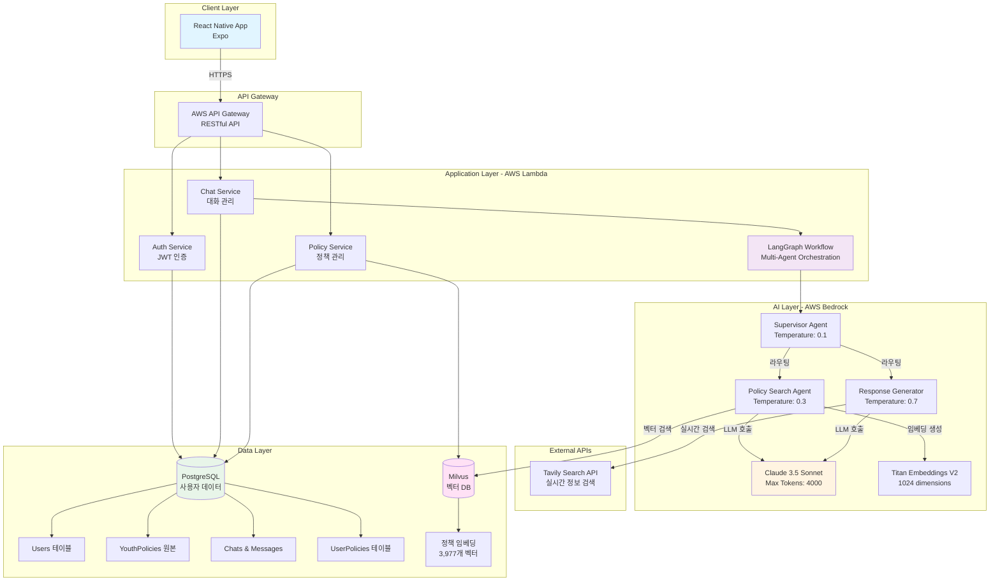
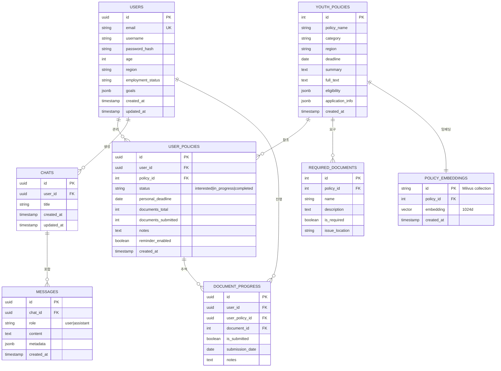
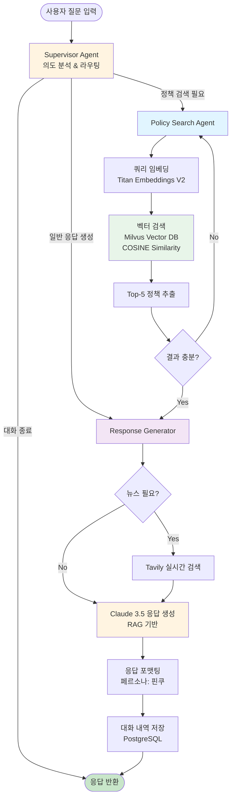

# FinQ - AI 기반 청년 금융 및 정책 코칭 서비스

## 프로젝트 개요

FinQ는 청년들의 금융 생활과 정책 활용을 돕는 AI 기반 모바일 애플리케이션입니다. 개인화된 AI 챗봇 '핀쿠'를 통해 금융 상담, 정책 추천, 일정 관리 등의 서비스를 제공하며, 청년들이 자신에게 맞는 정책을 쉽게 찾고 활용할 수 있도록 돕습니다.

**대회명**: 2025 새싹 AI 해커톤

**팀명**: FinQ

**팀원**: 김예은, 양은별, 김동현, 문영광

---

## 목차

1. [서비스 소개](#서비스-소개)
2. [배경 및 목적](#배경-및-목적)
3. [주요 기능](#주요-기능)
4. [기술 스택](#기술-스택)
5. [시스템 아키텍처](#시스템-아키텍처)
6. [설치 및 실행](#설치-및-실행)
7. [프로젝트 구조](#프로젝트-구조)
8. [AI Agent 전략](#ai-agent-전략)
9. [기대 효과](#기대-효과)
10. [라이선스](#라이선스)

---

## 서비스 소개

### 핀쿠 (FinQ AI Chatbot)

FinQ의 핵심인 AI 챗봇 '핀쿠'는 사용자의 금융 및 정책 관련 질문에 실시간으로 답변하며, 개인화된 추천을 제공합니다.

**핀쿠의 주요 역할**:
- 사용자 맞춤형 정책 추천
- 금융 관련 질문 응답
- 정책 일정 관리 및 알림
- 금융 퀴즈를 통한 학습 지원

### 서비스 핵심 가치

- **개인화**: 사용자의 나이, 지역, 소득, 관심사를 기반으로 한 맞춤형 정책 추천
- **편리성**: 복잡한 정책 정보를 쉽고 빠르게 탐색
- **실용성**: 정책 신청 일정 관리 및 체크리스트 제공
- **학습**: 금융 퀴즈를 통한 재미있는 금융 지식 습득

---

## 배경 및 목적

### 문제 인식

청년들은 다양한 금융 지원 정책이 존재함에도 불구하고 다음과 같은 어려움을 겪고 있습니다:

1. **정보 접근성 부족**: 정책 정보가 여러 사이트에 분산되어 있어 찾기 어려움
2. **복잡한 자격 요건**: 정책별 자격 요건이 복잡하여 본인에게 맞는 정책을 판단하기 어려움
3. **신청 절차의 어려움**: 필요 서류, 신청 방법, 마감일 등을 관리하기 어려움
4. **금융 지식 부족**: 기본적인 금융 용어나 개념에 대한 이해 부족

### 솔루션

FinQ는 AI 기술을 활용하여 이러한 문제를 해결합니다:

- **통합 플랫폼**: 모든 청년 정책 정보를 한 곳에서 제공
- **AI 기반 추천**: 사용자 프로필을 분석하여 맞춤형 정책 자동 추천
- **일정 관리**: 정책 신청 일정과 체크리스트를 자동으로 관리
- **대화형 학습**: AI 챗봇을 통한 쉽고 재미있는 금융 지식 습득

---

## 주요 기능

### 1. AI 챗봇 '핀쿠'

- **자연어 처리**: 사용자의 자연스러운 질문에 정확한 답변 제공
- **맥락 이해**: 이전 대화 내용을 기억하고 연관된 답변 제공
- **실시간 검색**: Tavily Search API를 활용한 최신 정책 정보 검색
- **개인화 추천**: 사용자 프로필 기반 정책 추천

### 2. 정책 탐색

- **카테고리별 분류**: 일자리, 주거, 교육, 창업, 복지 등
- **지역별 필터링**: 전국 단위 및 지역별 정책 검색
- **상세 정보 제공**: 지원 내용, 자격 요건, 신청 방법, 필요 서류
- **즐겨찾기 기능**: 관심 정책 저장

### 3. 오늘의 할 일

- **진행 현황 요약**: 전체 정책 진행률 시각화
- **체크리스트**: 정책별 필요 서류 및 준비 사항 체크
- **일정 알림**: D-day 표시 및 마감일 알림
- **포털 연결**: 정책 신청 사이트로 바로 이동

### 4. 금융 퀴즈

- **학습 모드**: 금융 용어 및 개념 학습
- **난이도 조절**: 사용자 수준에 맞는 문제 제공
- **즉각적인 피드백**: 정답 및 해설 제공
- **성장 추적**: 퀴즈 결과 기록 및 분석

### 5. FinQ PASS (프리미엄 기능)

- **무제한 AI 상담**: 월 10회 제한 해제
- **고급 AI 모델**: Claude 3.5 Sonnet 사용
- **우선 알림**: 새로운 정책 정보 우선 제공
- **맞춤형 리포트**: 월간 금융 활동 분석 리포트

---

## 기술 스택

### Frontend

- **Framework**: React Native with Expo
- **Language**: TypeScript
- **Navigation**: React Navigation (Stack & Bottom Tab)
- **UI Components**: Custom design system
- **State Management**: React Hooks
- **Styling**: StyleSheet (Centralized theme system)

### Backend

- **Runtime**: Python 3.11+
- **Framework**: FastAPI
- **Database**: PostgreSQL (사용자 데이터), Milvus (벡터 DB)
- **Authentication**: JWT
- **API Documentation**: RESTful API

### AI & ML

- **LLM**: AWS Bedrock Claude 3.5 Sonnet
- **Agent Framework**: LangGraph
- **Vector Database**: Milvus (정책 데이터 임베딩)
- **Search API**: Tavily Search API (실시간 정보 검색)
- **Embedding**: AWS Bedrock Titan Embeddings V2 (1024차원)

### Infrastructure

- **Cloud Platform**: AWS
- **Deployment**: Expo Application Services (EAS)
- **Containerization**: Docker Compose
- **Version Control**: Git & GitHub

---

## 시스템 아키텍처

### 1. 전체 시스템 아키텍처



### 2. 데이터베이스 ER 다이어그램



### 3. LangGraph Multi-Agent 워크플로우



### 주요 컴포넌트 설명

#### 1. Frontend (React Native + Expo)
- **사용자 인터페이스**: 온보딩, 챗봇, 정책 탐색, 일정 관리
- **상태 관리**: React Hooks, Context API
- **네비게이션**: React Navigation (Stack + Bottom Tab)
- **API 통신**: AWS API Gateway 연동

#### 2. Backend (AWS Lambda + FastAPI)
- **인증 서비스**: JWT 기반 사용자 인증
- **정책 서비스**: 청년 정책 CRUD 및 검색
- **챗봇 서비스**: LangGraph 워크플로우 오케스트레이션
- **벡터 검색**: Milvus를 활용한 시맨틱 검색

#### 3. AI Layer (LangGraph + AWS Bedrock)
- **Supervisor Agent**: 사용자 의도 분석 및 워크플로우 라우팅 (Temperature: 0.1)
- **Policy Search Agent**: 정책 검색 및 필터링 (Temperature: 0.3)
- **Response Generator**: RAG 기반 개인화 응답 생성 (Temperature: 0.7)
- **Claude 3.5 Sonnet**: 200K 컨텍스트, 4K 최대 출력
- **Titan Embeddings V2**: 1024차원 벡터 임베딩

#### 4. Data Layer (PostgreSQL + Milvus)
- **PostgreSQL**: 사용자 데이터, 정책 메타데이터, 대화 내역
  - Users: 사용자 정보 및 프로필
  - YouthPolicies: 청년 정책 원본 데이터
  - UserPolicies: 사용자별 관심 정책 및 진행 현황
  - Chats & Messages: 대화 내역 저장
  - DocumentProgress: 서류 제출 진행 상황 추적
- **Milvus**: 정책 벡터 임베딩 및 시맨틱 검색
  - PolicyEmbeddings: 3,977개 정책의 1024차원 벡터

---

## 설치 및 실행

### 사전 요구사항

- Node.js 18 이상
- Python 3.11 이상
- Docker & Docker Compose
- AWS 계정 (Bedrock 액세스)
- Expo CLI

### Frontend 설치 및 실행

```bash
# 저장소 클론
git clone https://github.com/your-repo/FinKuRN.git
cd FinKuRN

# 의존성 설치
npm install

# Expo 개발 서버 시작
npx expo start
```

**실행 옵션**:
- 웹 브라우저: `npx expo start --web`
- iOS 시뮬레이터 (macOS): `npx expo start --ios`
- Android 에뮬레이터: `npx expo start --android`

### Backend 설치 및 실행

```bash
cd backend

# 환경 변수 설정
cp .env.example .env
# .env 파일을 열어 AWS credentials 입력

# Docker 컨테이너 실행 (Milvus, API 서버)
docker-compose up -d

# 목업 데이터 로드 (최초 1회)
docker exec -it finkurn-backend python scripts/load_mock_data.py

# API 서버 확인
curl http://localhost:8000/health
```

**API 문서**: http://localhost:8000/docs

### 환경 변수 설정

프로젝트 루트에 `.env` 파일을 생성하고 다음 내용을 추가하세요:

```
API_BASE_URL=https://your-api-endpoint.com
AWS_BEDROCK_REGION=us-east-1
AWS_BEDROCK_MODEL_ID=anthropic.claude-3-5-sonnet-20241022-v2:0
MILVUS_HOST=your-milvus-host
MILVUS_PORT=19530
TAVILY_API_KEY=your-tavily-api-key
```

---

## 프로젝트 구조

```
ver4/
├── FinKuRN/                          # Frontend (React Native with Expo)
│   ├── src/
│   │   ├── screens/              # 화면 컴포넌트 (기능별 분류)
│   │   │   ├── auth/             # 인증 관련 화면
│   │   │   ├── onboarding/       # 온보딩 플로우
│   │   │   ├── home/             # 홈 화면
│   │   │   ├── chat/             # 챗봇 화면
│   │   │   ├── explore/          # 정책 탐색 화면
│   │   │   ├── plan/             # 일정 관리 화면
│   │   │   ├── policy/           # 정책 추천 화면
│   │   │   └── quiz/             # 퀴즈 화면
│   │   │
│   │   ├── components/           # 재사용 가능한 컴포넌트
│   │   │   ├── common/           # 공통 컴포넌트
│   │   │   ├── home/             # 홈 화면 전용 컴포넌트
│   │   │   └── plan/             # 일정 관리 전용 컴포넌트
│   │   │
│   │   ├── services/             # API 서비스 레이어
│   │   │   ├── authService.ts
│   │   │   ├── chatService.ts
│   │   │   ├── policyService.ts
│   │   │   └── quizService.ts
│   │   │
│   │   ├── types/                # TypeScript 타입 정의
│   │   ├── constants/            # 상수 및 테마
│   │   └── navigation/           # 네비게이션 설정
│   │
│   ├── App.tsx
│   └── package.json
│
├── backend/                          # Backend API Server
│   ├── app/
│   │   ├── main.py               # FastAPI 진입점
│   │   ├── langgraph/            # LangGraph Multi-Agent
│   │   │   ├── workflow.py
│   │   │   └── agents/
│   │   │       ├── supervisor.py
│   │   │       ├── policy_search.py
│   │   │       └── response_generator.py
│   │   │
│   │   ├── mcp/                  # FastMCP Tools
│   │   │   └── tools.py
│   │   │
│   │   └── db/                   # 데이터베이스 클라이언트
│   │       ├── milvus_client.py
│   │       └── neo4j_client.py
│   │
│   ├── data/
│   │   └── mock_policies.json
│   │
│   ├── docker-compose.yml
│   └── requirements.txt
│
└── README.md                         # 이 파일
```

---

## AI Agent 전략

### Multi-Agent Architecture

본 프로젝트는 **LangGraph 기반 Multi-Agent 시스템**을 채택하여, 복잡한 정책 추천 워크플로우를 단계별로 분리하고 각 단계에 특화된 에이전트를 배치했습니다.

### Agent 역할

**1. Supervisor Agent**
- **역할**: 사용자 의도 분석 및 워크플로우 라우팅
- **Temperature**: 0.1 (결정론적 라우팅)

**2. Policy Search Agent**
- **역할**: 사용자 쿼리에 적합한 정책 검색
- **Temperature**: 0.3 (일관된 검색)
- **도구**: Milvus Vector Search

**3. Response Generator Agent**
- **역할**: 검색된 정책 기반 맞춤형 응답 생성
- **Temperature**: 0.7 (창의적 응답)
- **전략**: RAG (Retrieval-Augmented Generation)

### Prompt Engineering Techniques

#### 1. Chain-of-Thought (CoT) Reasoning
단계별 추론 과정을 명시하여 의사결정 과정을 투명하게 합니다.

#### 2. Persona-Based Prompting
금융 전문가 페르소나를 부여하여 일관성 있는 응답을 생성합니다.

#### 3. ReAct Pattern
추론과 행동(Tool 사용)을 번갈아 수행하여 동적 의사결정을 합니다.

#### 4. Few-Shot Learning
예제 입출력을 포함하여 모델의 이해도를 높입니다.

### Model Parameters

| Agent | Temperature | Max Tokens | Purpose |
|-------|-------------|------------|---------|
| Supervisor | 0.1 | 500 | 결정론적 라우팅 |
| Policy Search | 0.3 | 1,000 | 일관된 검색 |
| Response Generator | 0.7 | 2,500 | 창의적 응답 |

### Vector Search Parameters

- **Metric Type**: COSINE
- **Top-K**: 5
- **Embedding Dimensions**: 1,024
- **Model**: AWS Bedrock Titan Embeddings V2

---

## 기대 효과

### 사용자 측면

1. **시간 절약**: 여러 사이트를 돌아다니며 정책을 찾을 필요 없이 한 곳에서 해결
2. **정보 접근성 향상**: 본인에게 맞는 정책을 쉽게 발견
3. **신청 성공률 증가**: 체계적인 일정 관리로 마감일을 놓치지 않음
4. **금융 지식 향상**: 퀴즈를 통한 재미있는 학습 경험

### 사회적 측면

1. **청년 정책 활용률 증가**: 좋은 정책이 더 많은 청년에게 혜택 제공
2. **금융 격차 해소**: 정보 접근성 향상으로 금융 불평등 완화
3. **청년 경제 활성화**: 금융 지원을 통한 청년 경제력 강화
4. **AI 기술의 사회적 가치 실현**: AI를 활용한 공공서비스 개선 사례

---

## 개발 원칙

### 코드 품질

- **타입 안정성**: TypeScript strict mode 사용, any 타입 금지
- **단일 책임 원칙**: 각 컴포넌트와 함수는 하나의 명확한 역할만 수행
- **DRY 원칙**: 코드 중복 제거, 재사용 가능한 컴포넌트 설계
- **명확한 네이밍**: 변수, 함수, 컴포넌트명을 의미 있게 작성
- **JSDoc 주석**: 모든 공개 함수와 컴포넌트에 문서화 주석 작성

### 아키텍처

- **관심사 분리**: UI, 비즈니스 로직, 데이터 레이어 명확히 분리
- **Feature-based 구조**: 기능별로 파일 조직화
- **Barrel exports**: index.ts를 통한 깔끔한 import 경로
- **중앙화된 테마**: 디자인 토큰 시스템으로 일관된 UI 유지

---

## 향후 계획

### Phase 1 (현재)

- React Native 앱 기본 구조 완성
- AI 챗봇 핵심 기능 구현
- 정책 탐색 및 관리 기능 구현
- LangGraph Multi-Agent 워크플로우 구축
- Milvus Vector DB 통합

### Phase 2

- Frontend-Backend API 연동
- 실제 정책 데이터베이스 연동
- 사용자 인증 및 프로필 관리
- Neo4j Graph DB 통합

### Phase 3

- FinQ PASS 프리미엄 기능 개발
- 푸시 알림 시스템 구축
- 금융 퀴즈 콘텐츠 확장

### Phase 4

- iOS 및 Android 앱스토어 출시
- 사용자 피드백 수집 및 개선
- 추가 정책 카테고리 확장

---

## API 엔드포인트

### Backend API Endpoints

**Base URL**: http://localhost:8000

#### Health Check
```bash
GET /health
Response: {"status": "ok", "timestamp": "..."}
```

#### Chat API (LangGraph Workflow)
```bash
POST /api/chats/{chat_id}/messages
Content-Type: application/json

Request Body:
{
  "message": "25살인데 청년 적금 추천해줘",
  "context": {
    "age": 25,
    "region": "서울",
    "employment_status": "재직"
  }
}

Response:
{
  "id": "msg_...",
  "chatId": "...",
  "content": "추천 정책 응답...",
  "role": "assistant",
  "timestamp": "...",
  "metadata": {
    "workflow_status": "success",
    "agents": ["supervisor", "policy_search", "response_generator"]
  }
}
```

자세한 API 문서: http://localhost:8000/docs

---

## 테스팅

### Backend API Testing

```bash
# Health check
curl http://localhost:8000/health

# Chat API 테스트
curl -X POST "http://localhost:8000/api/chats/test-session-001/messages" \
  -H "Content-Type: application/json" \
  -d '{
    "message": "25살인데 청년 적금 추천해줘",
    "context": {
      "age": 25,
      "region": "서울",
      "employment_status": "재직"
    }
  }'
```

### Frontend Testing

- Expo 개발 서버에서 수동 테스트
- iOS Simulator / Android Emulator 활용

---

## 문서

### Frontend
- **FinKuRN/README.md**: Frontend 프로젝트 개요
- **FinKuRN/src/README.md**: 소스 코드 구조
- **FinKuRN/src/components/README.md**: 컴포넌트 가이드

### Backend
- **backend/README.md**: Backend API 종합 문서
- **backend/.env.example**: 환경 변수 템플릿

---

## 라이선스

Copyright 2025 FinQ Team. All rights reserved.

---

## 팀원

- **김예은**: Product Manager, UI/UX Designer
- **양은별**: Frontend Developer
- **김동현**: Backend Developer, AI Engineer
- **문영광**: Frontend Developer, System Architect

---

## 연락처

프로젝트 관련 문의사항이나 협업 제안은 아래로 연락주시기 바랍니다.

- GitHub Issues: [https://github.com/your-repo/FinKuRN/issues](https://github.com/your-repo/FinKuRN/issues)
- Email: finq.team@example.com

---

## Acknowledgments

본 프로젝트는 2025 새싹 AI 해커톤 출품작입니다.

- AWS Bedrock 및 Claude 3.5 Sonnet 사용
- Tavily Search API 활용
- Expo 및 React Native 커뮤니티의 지원

---

**FinQ - 청년들의 더 나은 금융 생활을 위한 AI 파트너**
