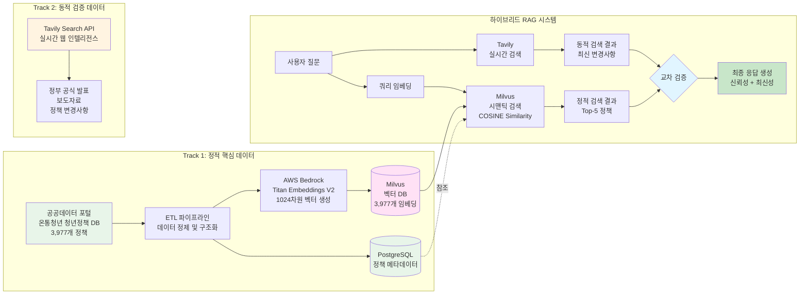
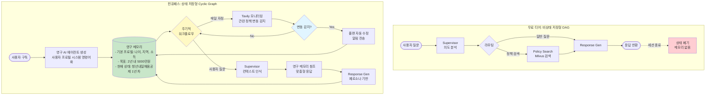
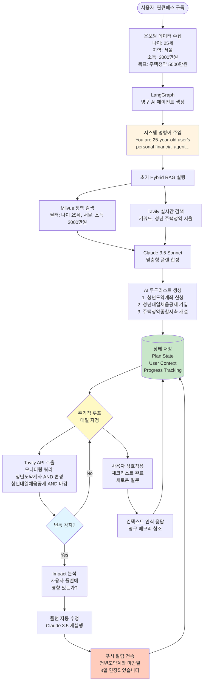

# FinQ 기획서용 아키텍처 다이어그램

이 파일은 **2025 새싹 AI 해커톤 기획서**에 삽입할 4개의 다이어그램을 포함합니다.

---

## 1. 2-Track 데이터 파이프라인: 정적 DB + 동적 웹 인텔리전스



**다이어그램 설명**:
- **Track 1 (정적)**: 온통청년 청년정책 DB 3,977개를 ETL 파이프라인으로 처리하여 PostgreSQL(메타데이터) + Milvus(벡터 임베딩)에 저장
- **Track 2 (동적)**: Tavily Search API로 실시간 정부 발표, 보도자료, 정책 변경사항 검색
- **하이브리드 RAG**: 정적 검색(Milvus)과 동적 검색(Tavily)을 교차 검증하여 신뢰성과 최신성을 동시에 확보

---

## 2. 기술 스택 3-Layer 아키텍처

```mermaid
graph TB
    subgraph "Layer 3: 모델 및 로직 계층"
        LangGraph[LangGraph<br/>Multi-Agent Orchestration<br/>상태 저장형 워크플로우]
        Claude[Claude 3.5 Sonnet<br/>200K Context<br/>4K Max Output]
        TitanEmbed[Titan Embeddings V2<br/>1024 Dimensions]
        HybridRAG[Hybrid RAG<br/>Milvus + Tavily]
        Agents[3-Agent System<br/>Supervisor | Policy Search | Response Generator]
    end

    subgraph "Layer 2: 인프라 계층"
        Bedrock[AWS Bedrock<br/>LLM 플랫폼<br/>안정적인 AI 호스팅]
        MilvusDB[Milvus Vector DB<br/>완전 관리형 서비스<br/>시맨틱 검색]
        PostgreSQLDB[PostgreSQL<br/>사용자 데이터<br/>정책 메타데이터]
        TavilyExt[Tavily Search API<br/>실시간 웹 검색]
        Lambda[AWS Lambda<br/>서버리스 API]
        APIGW[AWS API Gateway<br/>RESTful API]
    end

    subgraph "Layer 1: 데이터 계층"
        StaticData[정적 지식<br/>온통청년 DB<br/>3,977개 정책<br/>구조화된 메타데이터]
        DynamicData[동적 지식<br/>실시간 정책 변경<br/>마감일 업데이트<br/>신규 정책]
    end

    StaticData --> PostgreSQLDB
    StaticData --> MilvusDB
    DynamicData --> TavilyExt

    PostgreSQLDB --> Lambda
    MilvusDB --> Lambda
    TavilyExt --> Lambda
    Bedrock --> Lambda
    Lambda --> APIGW

    APIGW --> LangGraph
    Bedrock --> Claude
    Bedrock --> TitanEmbed
    LangGraph --> Agents
    LangGraph --> HybridRAG
    MilvusDB --> HybridRAG
    TavilyExt --> HybridRAG

    style Layer1 fill:#e8f5e9
    style Layer2 fill:#e1f5ff
    style Layer3 fill:#fff4e1
    style StaticData fill:#c8e6c9
    style DynamicData fill:#fff9c4
    style MilvusDB fill:#ffe1f5
    style Claude fill:#fce4ec
```

**다이어그램 설명**:
- **Layer 1 (데이터)**: 정적 지식(온통청년 DB) + 동적 지식(실시간 웹)
- **Layer 2 (인프라)**: AWS 서비스(Bedrock, Lambda, API Gateway) + Milvus + PostgreSQL + Tavily
- **Layer 3 (모델/로직)**: LangGraph 기반 Multi-Agent 시스템 + Hybrid RAG

---

## 3. 무료 티어 vs 핀큐패스 워크플로우 비교



**다이어그램 설명**:
- **무료 티어**: 비순환 DAG 구조, 일회성 처리, 세션 종료 시 상태 폐기
- **핀큐패스**: 순환 그래프, 영구 메모리, 주기적 모니터링, 능동적 플랜 관리

---

## 4. 핀큐패스 상태 저장형 에이전트 플로우 (상세)



**다이어그램 설명**:
- **초기화**: 사용자 프로필을 시스템 명령어로 주입하여 영구 AI 에이전트 생성
- **초기 플랜 수립**: Hybrid RAG(Milvus + Tavily)로 맞춤형 AI 투두리스트 생성
- **순환 워크플로우**: 매일 자정 Tavily로 관련 정책 변동 모니터링
- **능동적 관리**: 변동 감지 시 플랜 자동 수정 및 알림 전송
- **영구 메모리**: 모든 상태를 지속적으로 저장하고 참조

---

## 사용 방법

1. 위 다이어그램을 Mermaid 지원 도구에서 렌더링하세요:
   - GitHub Markdown
   - Notion
   - Obsidian
   - VS Code (Mermaid 플러그인)

2. 기획서 PT 슬라이드에 삽입:
   - Mermaid Live Editor (https://mermaid.live)에서 PNG/SVG로 export
   - PowerPoint/Keynote에 이미지로 삽입

3. 각 다이어그램 아래에 **다이어그램 설명**을 함께 첨부하여 심사위원의 이해를 돕습니다.

---

## 기술 스택 요약 테이블 (기획서 표 5-1에 삽입 가능)

| 구분 | 핵심 구성 요소 | 세부 기술 및 역할 |
|------|----------------|-------------------|
| **데이터 계층** | 정적 지식 | 온통청년 청년정책 DB 3,977개, 구조화된 메타데이터 및 정책 원문 |
| **데이터 계층** | 동적 지식 | Tavily Search API, 실시간 정책 변경, 마감일, 신규 정책 검증 |
| **인프라 계층** | 벡터 데이터베이스 | Milvus 완전 관리형 서비스, 3,977개 이상 데이터의 초고속 시맨틱 검색 및 메타데이터 필터링 |
| **인프라 계층** | LLM 플랫폼 | AWS Bedrock, 안정적인 AI 모델 호스팅 및 추론 수행 |
| **모델/로직 계층** | 파운데이션 LLM | Anthropic Claude 3.5 Sonnet via Bedrock, 고차원 추론, 자연어 이해, 계획 수립, 텍스트 생성 |
| **모델/로직 계층** | 오케스트레이션 | LangGraph, 비상태 및 상태 저장형, 순환, 다중 에이전트 워크플로우 구현 |
| **모델/로직 계층** | 검색 모델 | 하이브리드 RAG, Milvus의 정적 신뢰성과 Tavily의 동적 최신성 결합 |

---

Copyright 2025 FinQ Team. All rights reserved.
