# FinQ 완전한 AWS 시스템 아키텍처

이 문서는 **실제 배포된 AWS 인프라**를 포함한 FinQ의 완전한 시스템 아키텍처를 설명합니다.

---

## 전체 시스템 아키텍처 (AWS 인프라 포함)

```mermaid
graph TB
    subgraph "Client Layer"
        Mobile[React Native App<br/>Expo<br/>iOS & Android]
        Web[Web App<br/>Progressive Web App]
    end

    subgraph "AWS Cloud - Region: ap-northeast-2 Seoul"
        subgraph "API Gateway Layer"
            APIGW_WS[API Gateway WebSocket<br/>finkurn-chatbot-websocket<br/>wss://ws0lq0w7yh.execute-api.ap-northeast-2.amazonaws.com]
            APIGW_REST[API Gateway REST<br/>RESTful API<br/>HTTPS Endpoint]
        end

        subgraph "Compute Layer - AWS Lambda Python 3.12"
            LambdaAuth[finkurn-api<br/>인증 & 사용자 관리<br/>JWT 토큰 발급]
            LambdaChatbot[finkurn-chatbot<br/>AI 챗봇 처리<br/>LangGraph 워크플로우]
            LambdaWSConnect[finkurn-ws-connect<br/>WebSocket 연결]
            LambdaWSMessage[finkurn-ws-message<br/>실시간 메시지 처리]
            LambdaWSDisconnect[finkurn-ws-disconnect<br/>연결 종료 처리]
            LambdaLoadPolicies[finkurn-load-policies<br/>정책 데이터 ETL<br/>S3 → PostgreSQL + Milvus]
            LambdaCheckPgvector[finkurn-check-pgvector<br/>pgvector 확장 설치 확인]
            LambdaInstallPgvector[finkurn-install-pgvector<br/>pgvector 확장 설치]
            LambdaBackendV4[finkurn-backend-v4<br/>통합 백엔드 API]
        end

        subgraph "AI/ML Layer - AWS Bedrock"
            BedrockClaude[Claude 3.5 Sonnet<br/>anthropic.claude-3-5-sonnet<br/>Temperature: 0.1 / 0.3 / 0.7<br/>Max Tokens: 4000<br/>200K Context Window]
            BedrockTitan[Titan Embeddings V2<br/>amazon.titan-embed-text-v2:0<br/>1024 Dimensions<br/>정책 텍스트 → 벡터 변환]
        end

        subgraph "LangGraph Multi-Agent System"
            SupervisorAgent[Supervisor Agent<br/>의도 분석 & 라우팅<br/>Temperature: 0.1]
            PolicySearchAgent[Policy Search Agent<br/>정책 검색 & 필터링<br/>Temperature: 0.3]
            ResponseGenAgent[Response Generator<br/>RAG 기반 응답 생성<br/>Temperature: 0.7]
        end

        subgraph "Data Storage Layer"
            RDS[AWS RDS PostgreSQL 14<br/>finkurn-postgres<br/>Instance: db.t3.medium<br/>Storage: 100GB SSD<br/>Multi-AZ: No]

            subgraph "PostgreSQL Databases"
                DBUsers[(Users 테이블<br/>사용자 정보)]
                DBPolicies[(YouthPolicies<br/>정책 메타데이터<br/>3,977개 정책)]
                DBUserPolicies[(UserPolicies<br/>사용자-정책 매핑)]
                DBChats[(Chats & Messages<br/>대화 내역)]
                DBDocProgress[(DocumentProgress<br/>서류 진행 상황)]
            end

            Milvus[Milvus Vector DB<br/>완전 관리형 클라우드<br/>Collection: policy_embeddings<br/>3,977 벡터 × 1024차원<br/>Index: HNSW<br/>Metric: COSINE]

            S3[AWS S3 Bucket<br/>finkurn-policy-data<br/>정책 원본 JSON<br/>3,977개 파일]
        end

        subgraph "External Services"
            TavilyAPI[Tavily Search API<br/>실시간 웹 검색<br/>정책 변경사항 모니터링]
        end

        subgraph "IAM & Security"
            IAMRoles[IAM Roles<br/>- finkurn-lambda-execution-role<br/>- finkurn-ws-lambda-role<br/>- lambda-finkurn-role]
            SecretsManager[AWS Secrets Manager<br/>- RDS 자격증명<br/>- Milvus API Key<br/>- Tavily API Key<br/>- Bedrock 액세스]
        end

        subgraph "Monitoring & Logs"
            CloudWatch[CloudWatch Logs<br/>Lambda 실행 로그<br/>API Gateway 로그<br/>RDS 슬로우 쿼리]
            XRay[X-Ray Tracing<br/>분산 트레이싱<br/>성능 분석]
        end
    end

    subgraph "Development & Deployment"
        GitHub[GitHub Repository<br/>1282saa/ssaacc<br/>CI/CD Pipeline]
        LocalDev[Local Development<br/>Expo Dev Server<br/>Hot Reload]
    end

    %% Client to API Gateway
    Mobile -->|HTTPS/WSS| APIGW_REST
    Mobile -->|WebSocket| APIGW_WS
    Web -->|HTTPS/WSS| APIGW_REST
    Web -->|WebSocket| APIGW_WS

    %% API Gateway to Lambda
    APIGW_REST --> LambdaAuth
    APIGW_REST --> LambdaBackendV4
    APIGW_WS --> LambdaWSConnect
    APIGW_WS --> LambdaWSMessage
    APIGW_WS --> LambdaWSDisconnect
    LambdaWSMessage --> LambdaChatbot

    %% Lambda to LangGraph
    LambdaChatbot --> SupervisorAgent
    SupervisorAgent -->|정책 검색| PolicySearchAgent
    SupervisorAgent -->|일반 응답| ResponseGenAgent
    PolicySearchAgent --> ResponseGenAgent

    %% LangGraph to AI
    SupervisorAgent --> BedrockClaude
    PolicySearchAgent --> BedrockTitan
    PolicySearchAgent --> BedrockClaude
    ResponseGenAgent --> BedrockClaude

    %% Lambda to Data
    LambdaAuth --> RDS
    LambdaChatbot --> RDS
    LambdaBackendV4 --> RDS
    LambdaLoadPolicies --> S3
    LambdaLoadPolicies --> RDS
    LambdaLoadPolicies --> Milvus
    LambdaCheckPgvector --> RDS
    LambdaInstallPgvector --> RDS

    %% PostgreSQL Tables
    RDS --> DBUsers
    RDS --> DBPolicies
    RDS --> DBUserPolicies
    RDS --> DBChats
    RDS --> DBDocProgress

    %% Vector Search
    PolicySearchAgent --> Milvus
    BedrockTitan --> Milvus

    %% External API
    ResponseGenAgent --> TavilyAPI

    %% Security
    IAMRoles -.인증/권한.-> LambdaAuth
    IAMRoles -.인증/권한.-> LambdaChatbot
    IAMRoles -.인증/권한.-> LambdaWSConnect
    IAMRoles -.인증/권한.-> LambdaWSMessage
    IAMRoles -.인증/권한.-> LambdaWSDisconnect
    SecretsManager -.비밀키 제공.-> LambdaAuth
    SecretsManager -.비밀키 제공.-> LambdaChatbot
    SecretsManager -.비밀키 제공.-> LambdaLoadPolicies

    %% Monitoring
    LambdaAuth -.로그.-> CloudWatch
    LambdaChatbot -.로그.-> CloudWatch
    APIGW_REST -.로그.-> CloudWatch
    APIGW_WS -.로그.-> CloudWatch
    LambdaChatbot -.트레이싱.-> XRay

    %% Development
    GitHub -.배포.-> LambdaAuth
    GitHub -.배포.-> LambdaChatbot
    LocalDev -->|개발/테스트| Mobile

    style Mobile fill:#e1f5ff
    style APIGW_WS fill:#fff4e1
    style APIGW_REST fill:#fff4e1
    style BedrockClaude fill:#fce4ec
    style BedrockTitan fill:#fce4ec
    style RDS fill:#e8f5e9
    style Milvus fill:#ffe1f5
    style S3 fill:#fff9c4
    style SupervisorAgent fill:#e3f2fd
    style PolicySearchAgent fill:#e3f2fd
    style ResponseGenAgent fill:#e3f2fd
    style TavilyAPI fill:#ffecb3
    style CloudWatch fill:#f3e5f5
```

---

## 상세 컴포넌트 설명

### 1. Client Layer (클라이언트 계층)

#### Mobile App (React Native + Expo)
- **플랫폼**: iOS, Android
- **기술 스택**: React Native, TypeScript, Expo SDK
- **주요 기능**:
  - 사용자 인증 및 온보딩
  - AI 챗봇 대화 (WebSocket 실시간 통신)
  - 정책 탐색 및 관리
  - 금융 퀴즈
  - FinQ PASS 구독 관리

#### Web App (PWA)
- **플랫폼**: 웹 브라우저 (Expo Web)
- **기능**: 모바일과 동일한 UX

---

### 2. API Gateway Layer (API 게이트웨이 계층)

#### AWS API Gateway WebSocket
- **Endpoint**: `wss://ws0lq0w7yh.execute-api.ap-northeast-2.amazonaws.com`
- **API ID**: `ws0lq0w7yh`
- **프로토콜**: WebSocket
- **용도**: 실시간 AI 챗봇 대화
- **Routes**:
  - `$connect` → `finkurn-ws-connect`
  - `$default` (메시지 전송) → `finkurn-ws-message`
  - `$disconnect` → `finkurn-ws-disconnect`

#### AWS API Gateway REST
- **프로토콜**: HTTPS
- **인증**: JWT Bearer Token
- **주요 엔드포인트**:
  - `POST /api/auth/signup` - 회원가입
  - `POST /api/auth/login` - 로그인
  - `GET /api/policies` - 정책 목록 조회
  - `GET /api/user-policies` - 사용자 정책 조회
  - `POST /api/user-policies` - 관심 정책 추가

---

### 3. Compute Layer - AWS Lambda (컴퓨팅 계층)

모든 Lambda 함수는 **Python 3.12** 런타임 사용

#### finkurn-api
- **역할**: 인증 및 사용자 관리
- **기능**:
  - 회원가입, 로그인, 토큰 발급
  - JWT 토큰 검증
  - 사용자 프로필 CRUD

#### finkurn-chatbot
- **역할**: AI 챗봇 핵심 로직
- **기능**:
  - LangGraph Multi-Agent 워크플로우 실행
  - AWS Bedrock Claude 3.5 Sonnet 호출
  - Hybrid RAG (Milvus + Tavily) 수행
  - 대화 내역 저장

#### finkurn-ws-connect
- **역할**: WebSocket 연결 수립
- **기능**:
  - 클라이언트 WebSocket 연결 시작
  - 연결 ID를 PostgreSQL에 저장

#### finkurn-ws-message
- **역할**: WebSocket 메시지 처리
- **기능**:
  - 사용자 메시지 수신
  - `finkurn-chatbot` Lambda 호출
  - AI 응답을 WebSocket으로 실시간 전송

#### finkurn-ws-disconnect
- **역할**: WebSocket 연결 종료
- **기능**:
  - 연결 종료 처리
  - PostgreSQL에서 연결 정보 삭제

#### finkurn-load-policies
- **역할**: 정책 데이터 ETL 파이프라인
- **기능**:
  - S3에서 3,977개 정책 JSON 파일 읽기
  - PostgreSQL `YouthPolicies` 테이블에 삽입
  - Titan Embeddings V2로 벡터 생성
  - Milvus에 벡터 업로드
- **Lambda Function URL**: `https://iwfdio4fzazbzcukb3oevr4fbe0cdjwf.lambda-url.ap-northeast-2.on.aws/`

#### finkurn-check-pgvector
- **역할**: pgvector 확장 설치 확인
- **기능**: PostgreSQL에 pgvector 확장이 설치되었는지 검증

#### finkurn-install-pgvector
- **역할**: pgvector 확장 설치
- **기능**: PostgreSQL에 pgvector 확장 자동 설치

#### finkurn-backend-v4
- **역할**: 통합 백엔드 API
- **기능**: 정책 CRUD, 사용자 정책 관리

---

### 4. AI/ML Layer - AWS Bedrock (AI/ML 계층)

#### Claude 3.5 Sonnet
- **Model ID**: `anthropic.claude-3-5-sonnet-20241022-v2:0`
- **Context Window**: 200K 토큰
- **Max Output**: 4K 토큰
- **Temperature 설정**:
  - Supervisor Agent: 0.1 (결정론적 라우팅)
  - Policy Search Agent: 0.3 (일관된 검색)
  - Response Generator: 0.7 (창의적 응답)

#### Titan Embeddings V2
- **Model ID**: `amazon.titan-embed-text-v2:0`
- **Dimensions**: 1024차원
- **용도**: 정책 텍스트를 벡터로 변환하여 Milvus에 저장

---

### 5. LangGraph Multi-Agent System (멀티 에이전트 시스템)

#### Supervisor Agent
- **역할**: 사용자 의도 분석 및 워크플로우 라우팅
- **Temperature**: 0.1
- **결정 로직**:
  - 정책 검색이 필요하면 Policy Search Agent 호출
  - 일반 질문이면 Response Generator 직접 호출

#### Policy Search Agent
- **역할**: 정책 검색 및 필터링
- **Temperature**: 0.3
- **프로세스**:
  1. 사용자 질문을 Titan Embeddings V2로 벡터화
  2. Milvus에서 COSINE similarity로 Top-5 정책 검색
  3. 메타데이터 필터링 (나이, 지역, 소득 등)

#### Response Generator
- **역할**: RAG 기반 최종 응답 생성
- **Temperature**: 0.7
- **프로세스**:
  1. Policy Search Agent의 검색 결과 수신
  2. Tavily Search API로 실시간 뉴스 검색 (필요 시)
  3. Claude 3.5 Sonnet으로 사용자 친화적 응답 생성
  4. 페르소나: 친근한 AI 비서 "핀쿠"

---

### 6. Data Storage Layer (데이터 저장 계층)

#### AWS RDS PostgreSQL 14
- **인스턴스 ID**: `finkurn-postgres`
- **Instance Type**: `db.t3.medium` (2 vCPU, 4GB RAM)
- **Storage**: 100GB SSD (gp2)
- **Multi-AZ**: No (단일 AZ 배포)
- **Region**: ap-northeast-2 (Seoul)
- **Endpoint**: `finkurn-postgres.xyz.ap-northeast-2.rds.amazonaws.com:5432`

**PostgreSQL 테이블 구조**:

1. **Users**: 사용자 정보
   - `id` (UUID, PK)
   - `email` (UNIQUE)
   - `username`, `password_hash`
   - `age`, `region`, `employment_status`
   - `goals` (JSONB)

2. **YouthPolicies**: 청년 정책 메타데이터 (3,977개)
   - `id` (INT, PK)
   - `policy_name`, `category`, `region`
   - `deadline`, `summary`, `full_text`
   - `eligibility` (JSONB), `application_info` (JSONB)

3. **UserPolicies**: 사용자-정책 매핑
   - `id` (UUID, PK)
   - `user_id` (FK → Users), `policy_id` (FK → YouthPolicies)
   - `status` (interested | in_progress | completed)
   - `documents_total`, `documents_submitted`

4. **Chats & Messages**: 대화 내역
   - `chats`: 대화 세션
   - `messages`: 개별 메시지 (user | assistant)

5. **DocumentProgress**: 서류 제출 진행 상황
   - `user_policy_id` (FK → UserPolicies)
   - `document_id` (FK → RequiredDocuments)
   - `is_submitted`, `submission_date`

#### Milvus Vector Database
- **환경**: 완전 관리형 클라우드 (Zilliz Cloud 또는 자체 호스팅)
- **Collection**: `policy_embeddings`
- **벡터 수**: 3,977개 (각 정책당 1개)
- **Dimensions**: 1024차원 (Titan Embeddings V2)
- **Index Type**: HNSW (Hierarchical Navigable Small World)
- **Metric Type**: COSINE Similarity
- **Fields**:
  - `id` (Primary Key)
  - `policy_id` (INT, FK to YouthPolicies)
  - `embedding` (FLOAT_VECTOR, 1024d)
  - `metadata` (JSON)

#### AWS S3
- **Bucket**: `finkurn-policy-data`
- **Region**: ap-northeast-2
- **내용**: 온통청년 청년정책 원본 JSON 파일 3,977개
- **용도**: ETL 파이프라인 소스 데이터

---

### 7. External Services (외부 서비스)

#### Tavily Search API
- **용도**: 실시간 웹 인텔리전스
- **기능**:
  - 정부 공식 발표 검색
  - 정책 변경사항 모니터링
  - 마감일 업데이트 확인
- **통합 방식**: Response Generator에서 필요 시 호출

---

### 8. IAM & Security (보안)

#### IAM Roles
1. **finkurn-lambda-execution-role**
   - Lambda 기본 실행 권한
   - CloudWatch Logs 쓰기
   - Bedrock 액세스

2. **finkurn-ws-lambda-role**
   - WebSocket Lambda 전용
   - API Gateway WebSocket 연결 관리
   - CloudWatch Logs 쓰기

3. **lambda-finkurn-role**
   - 통합 백엔드 역할
   - RDS, S3, Bedrock, Milvus 접근

#### AWS Secrets Manager
- **저장 항목**:
  - RDS 마스터 자격증명
  - Milvus API Key
  - Tavily API Key
  - JWT Secret Key

---

### 9. Monitoring & Logs (모니터링 & 로그)

#### CloudWatch Logs
- Lambda 함수 실행 로그
- API Gateway 액세스 로그
- RDS 슬로우 쿼리 로그
- 에러 추적 및 알림

#### X-Ray Tracing
- 분산 트레이싱
- Lambda → Bedrock → RDS 호출 체인 시각화
- 성능 병목 지점 분석

---

### 10. Development & Deployment (개발 & 배포)

#### GitHub Repository
- **Repository**: `1282saa/ssaacc`
- **Branch**: `main`
- **CI/CD**: 수동 배포 (shell scripts)

#### Local Development
- **Expo Dev Server**: `npx expo start`
- **Hot Reload**: 실시간 코드 변경 반영
- **Testing**: iOS Simulator, Android Emulator, Web Browser

---

## 데이터 플로우 예시

### 사용자가 "25살인데 청년 적금 추천해줘" 질문 시

1. **Mobile App** → WebSocket 연결 → **API Gateway WebSocket**
2. **API Gateway** → `finkurn-ws-message` Lambda 호출
3. **finkurn-ws-message** → `finkurn-chatbot` Lambda 호출
4. **finkurn-chatbot** → LangGraph **Supervisor Agent** 시작
5. **Supervisor** → "정책 검색 필요" 판단 → **Policy Search Agent** 호출
6. **Policy Search Agent**:
   - 질문을 **Titan Embeddings V2**로 벡터화
   - **Milvus**에서 COSINE similarity Top-5 검색
   - 메타데이터 필터링 (나이: 25세, 지역: 서울)
7. **Response Generator**:
   - Policy Search 결과 수신
   - **Tavily API**로 "청년 적금 2025" 최신 뉴스 검색
   - 검색 결과 + 뉴스를 **Claude 3.5 Sonnet**에 전달
   - RAG 기반 응답 생성
8. **finkurn-chatbot** → 응답을 PostgreSQL **Messages** 테이블에 저장
9. **finkurn-ws-message** → WebSocket으로 클라이언트에 실시간 전송
10. **Mobile App** → 사용자에게 응답 표시

---

## AWS 리소스 비용 추정 (월별)

| 서비스 | 사용량 | 월 비용 (USD) |
|--------|--------|---------------|
| **RDS PostgreSQL t3.medium** | 730시간 (24/7) | $61.32 |
| **Lambda** | 100만 요청, 평균 3초 실행 | $20.00 |
| **API Gateway WebSocket** | 100만 메시지 | $1.00 |
| **Bedrock Claude 3.5** | 1M 입력 토큰, 100K 출력 토큰 | $15.00 |
| **Bedrock Titan Embeddings** | 1M 토큰 | $0.20 |
| **Milvus Cloud** | Starter Plan | $39.00 |
| **S3 Storage** | 1GB | $0.023 |
| **CloudWatch Logs** | 5GB | $2.50 |
| **Secrets Manager** | 4 secrets | $1.60 |
| **합계** | | **~$140/월** |

---

## 보안 고려사항

1. **API Gateway**:
   - HTTPS/WSS만 허용
   - JWT 토큰 인증
   - Rate limiting

2. **Lambda**:
   - IAM 역할 기반 최소 권한 부여
   - 환경 변수 암호화

3. **RDS**:
   - VPC 내부에 배포 (Public Access: No)
   - Security Group으로 Lambda만 접근 허용
   - 자동 백업 활성화

4. **Secrets Manager**:
   - 모든 민감 정보 중앙 관리
   - 자동 로테이션 설정

---

## 확장성 및 성능 최적화

1. **Lambda Cold Start 최소화**:
   - Provisioned Concurrency (필요 시)
   - 경량 Docker 이미지

2. **Milvus 성능**:
   - HNSW 인덱스로 빠른 벡터 검색
   - 메타데이터 필터링으로 검색 범위 축소

3. **RDS 최적화**:
   - Connection Pooling
   - 인덱스 최적화 (policy_id, user_id 등)

4. **Bedrock 비용 최적화**:
   - Prompt Caching 활용
   - Temperature 조정으로 토큰 절약

---

## 향후 계획

1. **Multi-AZ RDS**: 고가용성 확보
2. **CloudFront CDN**: 정적 자산 배포 속도 향상
3. **ElastiCache Redis**: 세션 캐싱
4. **Step Functions**: 복잡한 워크플로우 오케스트레이션
5. **EventBridge**: 주기적 정책 모니터링 자동화

---

Copyright 2025 FinQ Team. All rights reserved.
