# FinQ 완전 서버리스 아키텍처 (Serverless Architecture)

**실제 배포된 AWS 리소스 기반**
Region: ap-northeast-2 (Seoul)

---

## 🎯 서버리스 아키텍처 핵심 개념

FinQ는 **100% 서버리스 아키텍처**로 구축되어 있습니다:
- ❌ **서버 관리 불필요** (No EC2, No Container Orchestration)
- ✅ **자동 스케일링** (사용량에 따라 자동 확장/축소)
- ✅ **사용한 만큼만 비용 지불** (Pay-as-you-go)
- ✅ **고가용성** (AWS 관리형 서비스)
- ✅ **개발 속도 향상** (인프라 관리 대신 비즈니스 로직에 집중)

---

## 전체 서버리스 시스템 아키텍처

```mermaid
graph TB
    subgraph "Client Layer"
        Mobile[React Native App<br/>Expo<br/>iOS & Android]
        Web[Web Browser<br/>PWA]
    end

    subgraph "AWS Cloud - 100% Serverless - Region: ap-northeast-2"

        subgraph "Authentication & Authorization - AWS Cognito"
            Cognito[AWS Cognito User Pool<br/>finkurn-users<br/>Pool ID: ap-northeast-2_RcTjNChts<br/>Client ID: 4hrbaqo9ejvplk57ugv0if3u7l]
            CognitoFeatures[Cognito Features<br/>- 회원가입/로그인<br/>- JWT 토큰 발급<br/>- 비밀번호 암호화<br/>- MFA 지원 OFF]
        end

        subgraph "API Layer - AWS API Gateway"
            APIGW_REST[API Gateway REST API<br/>RESTful Endpoints<br/>- /api/policies<br/>- /api/user-policies<br/>- /api/chats]
            APIGW_WS[API Gateway WebSocket<br/>wss://ws0lq0w7yh.execute-api.ap-northeast-2.amazonaws.com<br/>실시간 AI 챗봇 통신]
            APIGWAuth[API Gateway Authorizer<br/>Cognito JWT 토큰 검증]
        end

        subgraph "Compute Layer - AWS Lambda Serverless Functions"
            direction TB
            LambdaAuth[finkurn-api<br/>Python 3.12<br/>128MB RAM<br/>인증 처리]
            LambdaBackend[finkurn-backend-v4<br/>Python 3.12<br/>1024MB RAM<br/>통합 백엔드 API]
            LambdaChatbot[finkurn-chatbot<br/>Python 3.12<br/>3008MB RAM<br/>AI 챗봇 LangGraph]
            LambdaWSConnect[finkurn-ws-connect<br/>Python 3.12<br/>WebSocket 연결]
            LambdaWSMessage[finkurn-ws-message<br/>Python 3.12<br/>메시지 처리]
            LambdaWSDisconnect[finkurn-ws-disconnect<br/>Python 3.12<br/>연결 해제]
            LambdaLoadPolicies[finkurn-load-policies<br/>Python 3.12<br/>1536MB RAM<br/>ETL Pipeline]
            LambdaCheckPgvector[finkurn-check-pgvector<br/>Python 3.12<br/>DB 확장 확인]
            LambdaInstallPgvector[finkurn-install-pgvector<br/>Python 3.12<br/>DB 확장 설치]
        end

        subgraph "AI/ML Layer - AWS Bedrock Serverless"
            Bedrock[AWS Bedrock<br/>완전 관리형 AI 서비스]
            BedrockClaude[Claude 3.5 Sonnet<br/>anthropic.claude-3-5-sonnet-20241022-v2:0<br/>Temperature: 0.1/0.3/0.7<br/>Max Tokens: 4000<br/>200K Context]
            BedrockTitan[Titan Embeddings V2<br/>amazon.titan-embed-text-v2:0<br/>1024 Dimensions<br/>벡터 생성]
        end

        subgraph "LangGraph Multi-Agent Workflow"
            SupervisorAgent[Supervisor Agent<br/>의도 분석 Temperature 0.1]
            PolicySearchAgent[Policy Search Agent<br/>정책 검색 Temperature 0.3]
            ResponseGenAgent[Response Generator<br/>RAG 응답 Temperature 0.7]
        end

        subgraph "Data Layer - Managed Database Services"
            RDS[AWS RDS PostgreSQL 14<br/>finkurn-postgres<br/>Instance: db.t3.medium<br/>2 vCPU, 4GB RAM<br/>100GB SSD Storage<br/>완전 관리형 DB]

            subgraph "PostgreSQL Tables"
                DBUsers[(Users<br/>사용자 계정)]
                DBPolicies[(YouthPolicies<br/>3,977개 정책)]
                DBUserPolicies[(UserPolicies<br/>사용자-정책 매핑)]
                DBChats[(Chats & Messages<br/>대화 내역)]
                DBDocProgress[(DocumentProgress<br/>서류 진행 상황)]
            end

            Milvus[Milvus Vector DB<br/>완전 관리형 클라우드<br/>Collection: policy_embeddings<br/>3,977 벡터 × 1024차원<br/>Index: HNSW<br/>Metric: COSINE]

            S3Policies[AWS S3 Bucket<br/>finkurn-policy-docs<br/>정책 원본 JSON<br/>3,977개 파일<br/>서버리스 스토리지]

            S3Lambda[AWS S3 Bucket<br/>finkurn-lambda-deployment<br/>Lambda 배포 패키지<br/>.zip 파일]
        end

        subgraph "External APIs"
            TavilyAPI[Tavily Search API<br/>실시간 웹 검색<br/>정책 변동 모니터링]
        end

        subgraph "Security & Secrets - AWS Managed Services"
            IAMRoles[IAM Roles<br/>Lambda 실행 권한<br/>최소 권한 원칙]
            SecretsManager[AWS Secrets Manager<br/>- RDS 자격증명<br/>- Milvus API Key<br/>- Tavily API Key<br/>자동 로테이션]
        end

        subgraph "Monitoring & Logging - AWS Managed Services"
            CloudWatch[CloudWatch Logs<br/>Lambda 로그 수집<br/>API Gateway 로그<br/>RDS 슬로우 쿼리]
            CloudWatchAlarms[CloudWatch Alarms<br/>- Lambda 에러율<br/>- RDS CPU 사용률<br/>- API Gateway 5xx 에러]
            XRay[X-Ray Tracing<br/>분산 트레이싱<br/>성능 병목 분석]
        end
    end

    %% Client to Cognito
    Mobile -->|회원가입/로그인| Cognito
    Web -->|회원가입/로그인| Cognito
    Cognito --> CognitoFeatures

    %% Client to API Gateway
    Mobile -->|HTTPS<br/>JWT Token| APIGW_REST
    Mobile -->|WSS<br/>실시간 통신| APIGW_WS
    Web -->|HTTPS<br/>JWT Token| APIGW_REST
    Web -->|WSS<br/>실시간 통신| APIGW_WS

    %% API Gateway Authorization
    APIGW_REST --> APIGWAuth
    APIGWAuth -->|토큰 검증| Cognito

    %% API Gateway to Lambda
    APIGW_REST -->|인증 통과| LambdaAuth
    APIGW_REST -->|인증 통과| LambdaBackend
    APIGW_WS -->|$connect| LambdaWSConnect
    APIGW_WS -->|$default| LambdaWSMessage
    APIGW_WS -->|$disconnect| LambdaWSDisconnect

    %% WebSocket to Chatbot
    LambdaWSMessage --> LambdaChatbot

    %% Lambda to LangGraph
    LambdaChatbot --> SupervisorAgent
    SupervisorAgent -->|정책 검색| PolicySearchAgent
    SupervisorAgent -->|일반 응답| ResponseGenAgent
    PolicySearchAgent --> ResponseGenAgent

    %% LangGraph to Bedrock
    SupervisorAgent --> Bedrock
    PolicySearchAgent --> Bedrock
    ResponseGenAgent --> Bedrock
    Bedrock --> BedrockClaude
    Bedrock --> BedrockTitan

    %% Lambda to Data
    LambdaAuth --> RDS
    LambdaBackend --> RDS
    LambdaChatbot --> RDS
    LambdaLoadPolicies --> S3Policies
    LambdaLoadPolicies --> RDS
    LambdaLoadPolicies --> Milvus
    LambdaCheckPgvector --> RDS
    LambdaInstallPgvector --> RDS

    %% RDS to Tables
    RDS --> DBUsers
    RDS --> DBPolicies
    RDS --> DBUserPolicies
    RDS --> DBChats
    RDS --> DBDocProgress

    %% Vector Search
    PolicySearchAgent --> Milvus
    BedrockTitan --> Milvus

    %% External API
    ResponseGenAgent --> TavilyAPI

    %% Lambda Deployment
    S3Lambda -.배포 패키지.-> LambdaAuth
    S3Lambda -.배포 패키지.-> LambdaBackend
    S3Lambda -.배포 패키지.-> LambdaChatbot

    %% Security
    IAMRoles -.실행 권한.-> LambdaAuth
    IAMRoles -.실행 권한.-> LambdaBackend
    IAMRoles -.실행 권한.-> LambdaChatbot
    IAMRoles -.실행 권한.-> LambdaWSConnect
    IAMRoles -.실행 권한.-> LambdaWSMessage
    IAMRoles -.실행 권한.-> LambdaWSDisconnect
    SecretsManager -.비밀키.-> LambdaAuth
    SecretsManager -.비밀키.-> LambdaChatbot
    SecretsManager -.비밀키.-> LambdaLoadPolicies

    %% Monitoring
    LambdaAuth -.로그.-> CloudWatch
    LambdaBackend -.로그.-> CloudWatch
    LambdaChatbot -.로그.-> CloudWatch
    APIGW_REST -.로그.-> CloudWatch
    APIGW_WS -.로그.-> CloudWatch
    RDS -.로그.-> CloudWatch
    CloudWatch --> CloudWatchAlarms
    LambdaChatbot -.트레이싱.-> XRay

    style Mobile fill:#e1f5ff
    style Cognito fill:#ffccbc
    style APIGW_REST fill:#fff4e1
    style APIGW_WS fill:#fff4e1
    style APIGWAuth fill:#ffecb3
    style BedrockClaude fill:#fce4ec
    style BedrockTitan fill:#fce4ec
    style RDS fill:#e8f5e9
    style Milvus fill:#ffe1f5
    style S3Policies fill:#fff9c4
    style S3Lambda fill:#fff9c4
    style SupervisorAgent fill:#e3f2fd
    style PolicySearchAgent fill:#e3f2fd
    style ResponseGenAgent fill:#e3f2fd
    style TavilyAPI fill:#ffecb3
    style CloudWatch fill:#f3e5f5
```

---

## 서버리스 컴포넌트 상세 설명

### 1. Authentication & Authorization - AWS Cognito

#### AWS Cognito User Pool
- **Pool Name**: `finkurn-users`
- **Pool ID**: `ap-northeast-2_RcTjNChts`
- **Client ID**: `4hrbaqo9ejvplk57ugv0if3u7l`
- **Region**: ap-northeast-2 (Seoul)
- **MFA**: OFF (추후 활성화 가능)

**주요 기능**:
- **회원가입**: 이메일/비밀번호 기반
- **로그인**: JWT 토큰 자동 발급
- **토큰 갱신**: Refresh Token 자동 관리
- **비밀번호 암호화**: AWS 관리형 암호화
- **세션 관리**: 서버리스 세션 (토큰 기반)

**장점**:
- 서버 관리 불필요
- 자동 확장 (동시 사용자 수 무제한)
- 내장 보안 기능 (DDoS 방어, 비밀번호 정책)
- 소셜 로그인 통합 가능 (Google, Facebook, Apple)

---

### 2. API Layer - AWS API Gateway

#### API Gateway REST API
- **엔드포인트**:
  - `POST /api/auth/signup` - 회원가입
  - `POST /api/auth/login` - 로그인
  - `GET /api/policies` - 정책 목록 조회
  - `POST /api/user-policies` - 관심 정책 추가
  - `GET /api/chats` - 대화 목록
- **Authorizer**: Cognito JWT 토큰 검증
- **Rate Limiting**: 10,000 requests/sec
- **Caching**: 300초 TTL (선택적)

#### API Gateway WebSocket API
- **Endpoint**: `wss://ws0lq0w7yh.execute-api.ap-northeast-2.amazonaws.com`
- **API ID**: `ws0lq0w7yh`
- **Routes**:
  - `$connect` → `finkurn-ws-connect` Lambda
  - `$default` (메시지) → `finkurn-ws-message` Lambda
  - `$disconnect` → `finkurn-ws-disconnect` Lambda
- **Idle Timeout**: 10분
- **Message Size Limit**: 128KB

**장점**:
- 서버리스 실시간 통신
- 자동 스케일링 (동시 연결 수 무제한)
- 연결 관리 자동화
- 사용한 메시지 수만큼 비용 발생

---

### 3. Compute Layer - AWS Lambda (서버리스 함수)

모든 Lambda 함수는 **Python 3.12** 런타임 사용

#### Lambda Functions 상세 스펙

| Lambda Function | Memory | Timeout | 역할 | 트리거 |
|-----------------|--------|---------|------|--------|
| **finkurn-api** | 128MB | 30초 | 인증 처리 | API Gateway REST |
| **finkurn-backend-v4** | 1024MB | 30초 | 통합 백엔드 API | API Gateway REST |
| **finkurn-chatbot** | 3008MB | 900초 (15분) | AI 챗봇 (LangGraph + Bedrock) | Lambda 직접 호출 |
| **finkurn-ws-connect** | 128MB | 30초 | WebSocket 연결 수립 | API Gateway WebSocket |
| **finkurn-ws-message** | 512MB | 60초 | 메시지 처리 & 라우팅 | API Gateway WebSocket |
| **finkurn-ws-disconnect** | 128MB | 30초 | 연결 해제 처리 | API Gateway WebSocket |
| **finkurn-load-policies** | 1536MB | 900초 (15분) | ETL 파이프라인 (S3 → RDS + Milvus) | Lambda Function URL |
| **finkurn-check-pgvector** | 128MB | 30초 | pgvector 확장 확인 | 수동 실행 |
| **finkurn-install-pgvector** | 128MB | 30초 | pgvector 확장 설치 | 수동 실행 |

**Lambda Function URL** (finkurn-load-policies):
- **URL**: `https://iwfdio4fzazbzcukb3oevr4fbe0cdjwf.lambda-url.ap-northeast-2.on.aws/`
- **Auth**: AWS_IAM (IAM 인증 필요)
- **용도**: S3 정책 데이터를 PostgreSQL + Milvus로 업로드

**장점**:
- **자동 스케일링**: 동시 실행 수 무제한 (기본 1,000, 증가 가능)
- **비용 최적화**: 실행 시간만큼만 과금 (100ms 단위)
- **Cold Start 최소화**: Provisioned Concurrency 사용 가능
- **서버 관리 불필요**: OS 패치, 보안 업데이트 자동

---

### 4. AI/ML Layer - AWS Bedrock (서버리스 AI)

#### AWS Bedrock
- **Service Type**: 완전 관리형 AI 서비스
- **특징**:
  - 서버 관리 불필요
  - 자동 스케일링
  - 사용한 토큰만큼만 비용 발생
  - 다양한 파운데이션 모델 제공

#### Claude 3.5 Sonnet
- **Model ID**: `anthropic.claude-3-5-sonnet-20241022-v2:0`
- **Context Window**: 200,000 토큰
- **Max Output**: 4,000 토큰
- **Temperature 설정**:
  - **Supervisor Agent**: 0.1 (결정론적)
  - **Policy Search Agent**: 0.3 (일관성)
  - **Response Generator**: 0.7 (창의성)

**비용** (2025년 1월 기준):
- 입력 토큰: $3.00 / 1M 토큰
- 출력 토큰: $15.00 / 1M 토큰

#### Titan Embeddings V2
- **Model ID**: `amazon.titan-embed-text-v2:0`
- **Dimensions**: 1024차원
- **Max Input Tokens**: 8,192 토큰
- **용도**: 정책 텍스트 → 벡터 변환

**비용** (2025년 1월 기준):
- 입력 토큰: $0.0002 / 1K 토큰

---

### 5. Data Layer - Managed Database Services

#### AWS RDS PostgreSQL (서버리스에 가까운 관리형 DB)
- **Instance ID**: `finkurn-postgres`
- **Engine**: PostgreSQL 14
- **Instance Class**: `db.t3.medium` (2 vCPU, 4GB RAM)
- **Storage**: 100GB General Purpose SSD (gp2)
- **Multi-AZ**: No (비용 절감)
- **Auto Minor Version Upgrade**: Yes
- **Automated Backups**: 7일 보관

**PostgreSQL 확장**:
- **pgvector**: 벡터 유사도 검색 (COSINE, EUCLIDEAN, INNER_PRODUCT)

**PostgreSQL 테이블**:
1. **Users**: 사용자 계정 정보
2. **YouthPolicies**: 청년 정책 메타데이터 (3,977개)
3. **UserPolicies**: 사용자-정책 매핑
4. **Chats**: 대화 세션
5. **Messages**: 개별 메시지
6. **RequiredDocuments**: 정책별 필요 서류
7. **DocumentProgress**: 서류 제출 진행 상황

**장점**:
- AWS가 DB 패치, 백업, 복구 자동 관리
- 자동 백업 (Point-in-Time Recovery)
- Read Replica 추가 가능
- CloudWatch 모니터링 자동 통합

**비용 최적화 옵션**:
- **Aurora Serverless v2**: 트래픽에 따라 자동 스케일 (미래 마이그레이션 가능)

#### Milvus Vector DB (완전 관리형 클라우드)
- **환경**: Zilliz Cloud (Milvus 완전 관리형)
- **Collection**: `policy_embeddings`
- **벡터 수**: 3,977개
- **Dimensions**: 1024차원
- **Index Type**: HNSW (Hierarchical Navigable Small World)
- **Metric**: COSINE Similarity
- **Auto Scaling**: 트래픽에 따라 자동 확장

**장점**:
- 서버 관리 불필요
- 자동 스케일링
- 초고속 벡터 검색 (ms 단위)
- CloudWatch 모니터링 통합

#### AWS S3 (완전 서버리스 스토리지)

**finkurn-policy-docs**:
- **용도**: 온통청년 청년정책 원본 JSON 파일 저장
- **파일 수**: 3,977개
- **Storage Class**: Standard (자주 액세스)
- **Versioning**: Enabled (데이터 보호)
- **Encryption**: SSE-S3 (서버 측 암호화)

**finkurn-lambda-deployment**:
- **용도**: Lambda 배포 패키지 (.zip 파일)
- **Size**: 각 Lambda당 50-200MB
- **Versioning**: Enabled

**장점**:
- 무제한 스토리지
- 11 9s (99.999999999%) 내구성
- 자동 스케일링
- 사용한 용량만큼만 비용 발생

---

### 6. External APIs

#### Tavily Search API
- **용도**: 실시간 웹 인텔리전스
- **통합 방식**: Response Generator에서 HTTP 요청
- **기능**:
  - 정부 공식 발표 검색
  - 정책 변경사항 모니터링
  - 마감일 업데이트 확인

---

### 7. Security & Secrets (AWS 관리형 서비스)

#### IAM Roles (최소 권한 원칙)
- **finkurn-lambda-execution-role**
  - CloudWatch Logs 쓰기
  - Bedrock 호출
  - RDS 접근
- **finkurn-ws-lambda-role**
  - API Gateway WebSocket 관리
  - CloudWatch Logs 쓰기
- **lambda-finkurn-role**
  - S3 읽기
  - Milvus API 호출
  - Secrets Manager 읽기

#### AWS Secrets Manager
- **저장 항목**:
  - RDS 마스터 자격증명
  - Milvus API Key
  - Tavily API Key
  - JWT Secret Key
- **자동 로테이션**: 30일마다 비밀번호 자동 변경 (선택적)

**장점**:
- 코드에 비밀키 하드코딩 방지
- 자동 암호화 (AWS KMS)
- 감사 로그 (CloudTrail)

---

### 8. Monitoring & Logging (AWS 관리형 서비스)

#### CloudWatch Logs
- Lambda 실행 로그 자동 수집
- API Gateway 액세스 로그
- RDS 슬로우 쿼리 로그
- 로그 보관 기간: 30일

#### CloudWatch Alarms
- **Lambda 에러율**: 5% 초과 시 SNS 알림
- **RDS CPU 사용률**: 80% 초과 시 알림
- **API Gateway 5xx 에러**: 10개/분 초과 시 알림

#### AWS X-Ray
- Lambda → Bedrock → RDS 호출 체인 시각화
- 평균 응답 시간 추적
- 병목 지점 자동 감지

---

## 서버리스 아키텍처의 장점

### 1. 비용 최적화
- **Lambda**: 실행 시간만큼만 과금 (100ms 단위)
- **API Gateway**: 요청 수만큼만 과금
- **Bedrock**: 사용한 토큰만큼만 과금
- **RDS**: 인스턴스 시간만큼 과금 (향후 Aurora Serverless v2로 전환 가능)
- **S3**: 저장 용량과 요청 수만큼만 과금

**예상 월 비용** (월 100만 요청 기준):
- Lambda: $20
- API Gateway: $3.50
- Cognito: 무료 (MAU 50,000명까지)
- Bedrock Claude: $15
- Bedrock Titan: $0.20
- RDS: $61 (향후 Aurora Serverless로 최적화 가능)
- Milvus: $39
- S3: $0.50
- Secrets Manager: $1.60
- CloudWatch: $5
- **합계**: ~$146/월

### 2. 자동 스케일링
- **트래픽 급증 시**: Lambda가 자동으로 동시 실행 수 증가
- **트래픽 감소 시**: 자동으로 인스턴스 감소 (비용 절감)
- **Cold Start 최소화**: Provisioned Concurrency 사용 가능

### 3. 고가용성
- **Multi-AZ 기본**: Lambda, API Gateway, Cognito는 기본적으로 Multi-AZ
- **자동 장애 조치**: AWS가 자동으로 장애 복구
- **99.95% SLA**: API Gateway, Lambda, Cognito 모두 SLA 보장

### 4. 개발 속도 향상
- **인프라 관리 불필요**: OS 패치, 보안 업데이트 자동
- **빠른 배포**: Lambda 코드 업데이트 수초 내 반영
- **A/B 테스팅**: Lambda Alias로 트래픽 분할 가능

### 5. 보안
- **AWS Shield**: DDoS 방어 자동
- **IAM 기반 권한**: 최소 권한 원칙
- **VPC 격리**: Lambda가 VPC 내부에서 RDS 접근 (외부 접근 차단)
- **암호화**: 전송 중 (TLS), 저장 시 (S3 SSE, Secrets Manager KMS) 자동 암호화

---

## 데이터 플로우 예시 (서버리스 아키텍처)

### 사용자가 "25살인데 청년 적금 추천해줘" 질문 시

1. **Mobile App** → **Cognito**에 로그인 → JWT 토큰 받음
2. **Mobile App** → WebSocket 연결 → **API Gateway WebSocket** (`wss://ws0lq0w7yh...`)
3. **API Gateway** → **`finkurn-ws-connect` Lambda** 호출 (연결 수립)
4. **사용자 메시지 전송** → **API Gateway** → **`finkurn-ws-message` Lambda** 호출
5. **`finkurn-ws-message`** → **`finkurn-chatbot` Lambda** 호출 (3008MB RAM, 15분 Timeout)
6. **`finkurn-chatbot`** → **LangGraph Supervisor Agent** 시작 (Temperature 0.1)
7. **Supervisor** → **AWS Bedrock Claude 3.5** 호출 → "정책 검색 필요" 판단
8. **Supervisor** → **Policy Search Agent** 호출 (Temperature 0.3)
9. **Policy Search Agent**:
   - **AWS Bedrock Titan Embeddings V2** 호출 → 질문을 1024차원 벡터로 변환
   - **Milvus Vector DB** 검색 (COSINE Similarity) → Top-5 정책 추출
   - 메타데이터 필터링 (나이: 25세, 지역: 서울) in **PostgreSQL RDS**
10. **Response Generator** (Temperature 0.7):
    - Policy Search 결과 수신
    - **Tavily Search API** 호출 → "청년 적금 2025" 최신 뉴스
    - **AWS Bedrock Claude 3.5** 호출 → RAG 기반 응답 생성
11. **`finkurn-chatbot`** → 응답을 **PostgreSQL RDS Messages** 테이블에 저장
12. **`finkurn-ws-message`** → WebSocket으로 클라이언트에 실시간 전송
13. **Mobile App** → 사용자에게 응답 표시
14. **모든 로그** → **CloudWatch Logs** 자동 수집
15. **성능 트레이싱** → **X-Ray**로 Lambda → Bedrock → RDS 호출 체인 시각화

**총 처리 시간**: 2-5초 (서버리스 자동 스케일링)

---

## 서버리스 vs 전통적 서버 비교

| 항목 | 서버리스 (FinQ 현재) | 전통적 서버 (EC2) |
|------|---------------------|-------------------|
| **서버 관리** | 불필요 (AWS 관리) | 필요 (OS 패치, 보안 업데이트) |
| **스케일링** | 자동 (트래픽에 따라) | 수동 (Auto Scaling Group 설정) |
| **비용** | 사용한 만큼만 지불 | 24/7 인스턴스 비용 |
| **고가용성** | 기본 Multi-AZ | 직접 구성 필요 |
| **배포 속도** | 수초 (Lambda 코드 업데이트) | 수분 (인스턴스 재시작) |
| **Cold Start** | 있음 (최초 실행 시) | 없음 (항상 실행 중) |
| **모니터링** | CloudWatch 자동 통합 | 직접 설정 필요 |
| **보안** | AWS Shield, IAM 기본 | 직접 설정 필요 |

---

## 향후 최적화 계획

### 1. Aurora Serverless v2 마이그레이션
- **현재**: RDS PostgreSQL t3.medium (24/7 실행)
- **마이그레이션**: Aurora Serverless v2 (ACU 자동 스케일링)
- **예상 비용 절감**: 30-50% (트래픽 패턴에 따라)

### 2. Lambda Provisioned Concurrency
- **목적**: Cold Start 완전 제거
- **대상**: `finkurn-chatbot` Lambda (AI 챗봇)
- **비용**: +$10/월 (2개 인스턴스 Always Warm)

### 3. CloudFront CDN
- **목적**: 정적 자산 캐싱 (React Native 웹 번들)
- **효과**: 로딩 속도 50% 향상, API Gateway 비용 절감

### 4. EventBridge Scheduler
- **목적**: 주기적 정책 모니터링 자동화
- **예시**: 매일 자정 Tavily API로 정책 변경사항 확인 → Lambda 트리거

### 5. Step Functions
- **목적**: 복잡한 워크플로우 오케스트레이션
- **예시**: ETL Pipeline (S3 → RDS → Milvus) 시각화 및 에러 핸들링

---

## 실제 배포된 AWS 리소스 요약

### Cognito
- **User Pool**: `finkurn-users` (ap-northeast-2_RcTjNChts)

### Lambda Functions (9개)
- finkurn-api
- finkurn-backend-v4
- finkurn-chatbot
- finkurn-ws-connect
- finkurn-ws-message
- finkurn-ws-disconnect
- finkurn-load-policies
- finkurn-check-pgvector
- finkurn-install-pgvector

### API Gateway
- **WebSocket API**: ws0lq0w7yh

### RDS
- **PostgreSQL 14**: finkurn-postgres (db.t3.medium)

### S3 Buckets (3개)
- finkurn-policy-docs (정책 원본)
- finkurn-lambda-deployment (배포 패키지)
- finkurn-lambda-deployments (배포 패키지 백업)

### Bedrock Models
- Claude 3.5 Sonnet (anthropic.claude-3-5-sonnet-20241022-v2:0)
- Titan Embeddings V2 (amazon.titan-embed-text-v2:0)

### Milvus
- Collection: policy_embeddings (3,977 벡터 × 1024d)

---

Copyright 2025 FinQ Team. All rights reserved.
